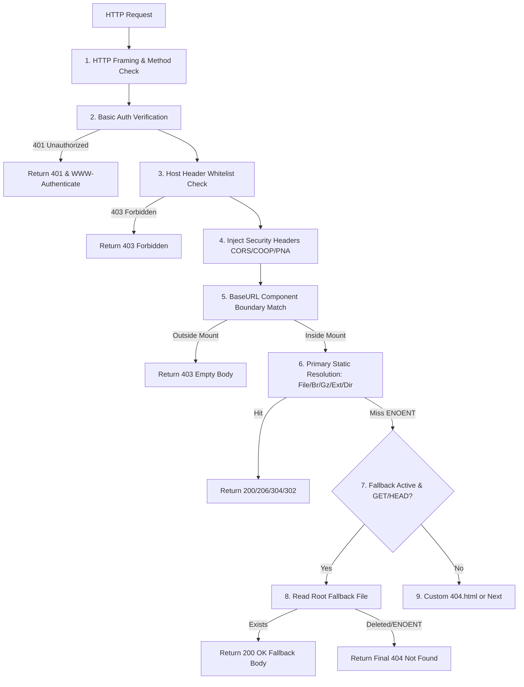

# Architecture & Implementation Strategy: M2 Config & Routing Contracts

## 1. Executive Summary

This strategy specifies the exact architecture, data models, validation contracts, and routing algorithms for Milestone 2 (M2) in `unmbt/http-server-mbt/core`. It addresses three core requirements:
1. **Config Model Expansion**: Expanding `core.Config` from an 8-field prototype into a complete, production-grade configuration model supporting all options from original `http-server` plus project extensions (`base_url`, `spa`, `try_files`, `proxy`, `basic_auth`, `host_whitelist`, `security_headers`, etc.), providing dual defaults (Server/CLI default vs. Core Middleware default per AD-02).
2. **BaseURL Route Mounting & Component Boundary Matching (D-04, N-01)**: Strict URL normalization (`app`, `/app`, `/app/` -> `/app`), alias resolution (`--base-url` vs `--base-dir`), strict component boundary matching (`/app` matches `/app` and `/app/page`, but rejects `/application`), mount prefix stripping for root-anchored file resolution, and preservation of `base_url` and query strings in directory 302 redirects.
3. **SPA & Try-Files Route Fallback and Mutual Exclusion Validation (D-04, N-02, N-03)**: Pre-listen mutual exclusion enforcement (`--spa` vs `--try-files`, fallback vs `--proxy`), root-relative try-files path syntactic validation (no traversal, no leading slash, no nulls), delayed custom 404 in fallback mode, and strict preservation of 401 Unauthorized, 403 Forbidden, and path traversal errors (never swallowing auth/security errors into SPA 200).

All pure data structures, validation functions, and string routing algorithms reside strictly in `core/` with **zero platform I/O dependencies**, ensuring 100% portability across Native and wasm-gc.

---

## 2. Configuration Model Architecture

### 2.1 Complete `core.Config` Field Definition

In `core/config.mbt`:

```moonbit
///|
/// Normalized static-server configuration model.
/// Contains all configuration settings for protocol, static resolution,
/// routing mounts, SPA fallback, security policies, and upstream proxies.
pub(all) struct Config {
  // --- Filesystem & Network ---
  root : String                          // Filesystem root directory (default "." or "public")
  port : Int                             // TCP listen port (0..65535, 0 = ephemeral)
  address : String                       // Bind address ("0.0.0.0", "::", etc.)
  
  // --- Routing & Mounts ---
  base_url : String                      // Normalized URL mount prefix (e.g. "/", "/app")
  default_ext : String?                  // Default file extension completion (e.g. Some("html"))
  spa : Bool                             // SPA fallback to root index.html
  try_files : String?                    // Custom fallback file relative to root
  
  // --- Compression ---
  gzip : Bool                            // Detect & serve pre-compressed .gz files
  brotli : Bool                          // Detect & serve pre-compressed .br files
  
  // --- Directory Handling ---
  auto_index : Bool                      // Serve index.html when requesting a directory
  show_dir : Bool                        // Render HTML directory listing if no index file
  show_dotfiles : Bool                   // Include hidden/dotfiles in directory listing
  dir_overrides_404 : Bool               // Directory listing takes precedence over custom 404.html
  
  // --- Caching & ETag ---
  cache_seconds : Int                    // Cache duration in seconds (-1 = no-cache, no-store)
  cache_control : String?                // Explicit Cache-Control header override
  weak_etags : Bool                      // Generate weak ETags (W/"...")
  weak_compare : Bool                    // Compare ETags using weak comparison
  
  // --- Security & Headers ---
  cors : Bool                            // Enable CORS headers (Access-Control-Allow-Origin: *)
  cors_headers : String?                 // Custom Access-Control-Allow-Headers
  coop : Bool                            // Cross-Origin-Opener-Policy: same-origin
  pna : Bool                             // Access-Control-Allow-Private-Network: true
  basic_auth : (String, String)?         // (username, password) for HTTP Basic Auth
  host_whitelist : Array[String]         // Allowed Host header values (empty = allow all)
  custom_headers : Map[String, String]   // User-defined headers injected into all responses
  robots : Bool                          // Serve default User-agent: *\nDisallow: / for /robots.txt
  
  // --- Proxy & Upstream ---
  proxy : String?                        // Upstream proxy target (e.g. "http://127.0.0.1:3000")
  proxy_all : String?                    // Proxy all requests upstream (requires proxy to be set)
  proxy_options : Map[String, String]    // Upstream proxy options (must be empty if fallback active)
  
  // --- Lifecycle & Error Handling ---
  handle_error : Bool                    // If false, delegates 404/errors to host (middleware Next)
  idle_timeout_ms : Int                  // Socket idle timeout in ms (0 = disabled, default 120000)
  mime_types : Map[String, String]       // Custom extension -> MIME type overrides
} derive(Debug)
```

### 2.2 Dual Default Constructors (Addressing AD-02)

Per D-01 and AD-02:
- **Server/CLI Defaults**: `gzip = false`, `brotli = false`, `cache_seconds = 3600`, `idle_timeout_ms = 120000`.
- **Core Middleware Defaults**: `gzip = true` (retaining original `lib/core/opts.js` compatibility), `brotli = false`, `cache_seconds = 3600`.

```moonbit
///|
/// Build Server & CLI defaults for a filesystem root directory.
pub fn Config::default(root : String) -> Config {
  {
    root,
    port: 8080,
    address: "0.0.0.0",
    base_url: "/",
    default_ext: Some("html"),
    spa: false,
    try_files: None,
    gzip: false,                 // Server/CLI default is false per AD-02
    brotli: false,
    auto_index: true,
    show_dir: true,
    show_dotfiles: false,
    dir_overrides_404: false,
    cache_seconds: 3600,
    cache_control: None,
    weak_etags: true,
    weak_compare: true,
    cors: false,
    cors_headers: None,
    coop: false,
    pna: false,
    basic_auth: None,
    host_whitelist: [],
    custom_headers: Map([]),
    robots: false,
    proxy: None,
    proxy_all: None,
    proxy_options: Map([]),
    handle_error: true,
    idle_timeout_ms: 120000,     // 120 seconds per AD-03
    mime_types: Map([]),
  }
}

///|
/// Build Core Middleware defaults for a filesystem root directory (AD-02 compatibility).
pub fn Config::middleware_default(root : String) -> Config {
  {
    ..Config::default(root),
    gzip: true,                  // Core middleware default is true per AD-02
  }
}
```

### 2.3 Helper Methods on `Config`

```moonbit
///|
/// Determine active page fallback mode.
pub fn Config::fallback_mode(self : Config) -> FallbackMode {
  if self.spa {
    FallbackMode::Spa
  } else {
    match self.try_files {
      Some(f) => FallbackMode::TryFiles(f)
      None => FallbackMode::None
    }
  }
}

///|
/// Returns whether any fallback mode is enabled.
pub fn Config::has_fallback(self : Config) -> Bool {
  self.spa || self.try_files is Some(_)
}

///|
/// Returns whether any upstream proxy mode is configured.
pub fn Config::has_proxy(self : Config) -> Bool {
  self.proxy is Some(_) || self.proxy_all is Some(_) || !self.proxy_options.is_empty()
}

///|
/// Returns the relative file path to serve on fallback, if enabled.
pub fn Config::fallback_target_file(self : Config) -> String? {
  if self.spa {
    Some("index.html")
  } else {
    self.try_files
  }
}

///|
/// Returns the effective Cache-Control header string.
pub fn Config::effective_cache_control(self : Config) -> String {
  match self.cache_control {
    Some(custom) => custom
    None =>
      if self.cache_seconds < 0 {
        "no-cache, no-store, must-revalidate"
      } else {
        "max-age=" + self.cache_seconds.to_string()
      }
  }
}
```

---

## 3. BaseURL Route Mounting & Component Boundary Matching (D-04, N-01)

### 3.1 Strict Normalization Rules

`base_url` represents a URL path prefix (not a host, disk root, or query).
- **Rule 1**: Input `""` or `"/"` normalizes to `"/"`.
- **Rule 2**: Leading `/` is prepended if missing (`app` -> `/app`).
- **Rule 3**: Trailing `/` is stripped if length > 1 (`/app/` -> `/app`, `app/` -> `/app`). Root `/` remains `/`.
- **Rule 4**: Must strictly reject invalid characters:
  - Query delimiter: `?`
  - Fragment delimiter: `#`
  - Windows separator: `\`
  - Control characters: NUL `\u0000`, CR `\r`, LF `\n`
  - Dot segments: `..` (directory traversal prohibited in URL prefix)
  - Consecutive slashes: `//`
- **Rule 5**: Non-ASCII UTF-8 characters (e.g. `中文`) are permitted.

```moonbit
///|
/// Normalize a URL mount prefix per D-04.
pub fn normalize_base_url(value : String) -> String raise ConfigError {
  if value == "" || value == "/" {
    return "/"
  }
  if value.contains("?") ||
    value.contains("#") ||
    value.contains("\\") ||
    value.contains("\u0000") ||
    value.contains("\r") ||
    value.contains("\n") {
    raise ConfigError::InvalidBaseUrl("base_url contains invalid characters")
  }
  if value.contains("..") || value.contains("//") {
    raise ConfigError::InvalidBaseUrl("base_url contains dot segments or consecutive slashes")
  }
  let prefixed = if value[0] == '/' { value } else { "/" + value }
  if prefixed.length() > 1 && prefixed[prefixed.length() - 1] == '/' {
    prefixed[:prefixed.length() - 1].to_owned()
  } else {
    prefixed
  }
}
```

### 3.2 CLI / Config Alias Resolution (`--base-url` vs `--base-dir`)

Per D-04: `--base-url` and `--base-dir` map to the same conceptual mount field.
- If only one is specified: normalize and use it.
- If both are specified: normalize both. If they differ, raise `ConfigError::ConflictingBaseUrl`. If identical, accept.

```moonbit
///|
/// Resolve base_url and base_dir aliases.
pub fn resolve_base_url(
  base_url : String?,
  base_dir : String?,
) -> String raise ConfigError {
  match (base_url, base_dir) {
    (None, None) => "/"
    (Some(u), None) => normalize_base_url(u)
    (None, Some(d)) => normalize_base_url(d)
    (Some(u), Some(d)) => {
      let norm_u = normalize_base_url(u)
      let norm_d = normalize_base_url(d)
      if norm_u != norm_d {
        raise ConfigError::ConflictingBaseUrl(
          "conflicting --base-url '\{u}' and --base-dir '\{d}'"
        )
      }
      norm_u
    }
  }
}
```

### 3.3 Strict Component Boundary Matching (N-01)

D-04 Requirement:
> 已通过鉴权和路径安全验证的本地请求，按完整路径组件匹配 BaseURL。`/app` 与 `/app/...` 匹配，`/application` 不匹配；挂载外独立静态响应为 403 空正文，宿主委托模式返回 Forbidden。

#### Boundary Matching Condition
Given normalized `base_url`:
1. If `base_url == "/"` (root mount):
   - Path must start with `'/'`.
   - Suffix is `path[1:]`.
   - Stripped relative path is `suffix`.
2. If `base_url != "/"` (e.g. `"/app"`):
   - Case A: `path == base_url` (e.g. `"/app"`) -> MATCH! Relative path is `""`.
   - Case B: `path.starts_with(base_url)` AND `path[base_url.length()] == '/'` (e.g. `"/app/foo"`) -> MATCH!
     Suffix starts at `base_url.length() + 1`. Relative path is `path[base_url.length() + 1:]`.
   - Case C: `path.starts_with(base_url)` BUT `path[base_url.length()] != '/'` (e.g. `"/application"`, `"/app-dir"`):
     **MISMATCH**! The request hits an unrelated URL prefix. Return `None`.
   - Case D: `!path.starts_with(base_url)` (e.g. `"/"`, `"/api"`) -> **MISMATCH**! Return `None`.

```moonbit
///|
/// Match a decoded request path against the normalized base_url using strict
/// component boundary matching. Returns Some(relative_path) on match, or None
/// if the request falls outside the base_url mount.
pub fn match_and_strip_base_url(base_url : String, decoded_path : String) -> String? {
  if base_url == "/" {
    if decoded_path.length() > 0 && decoded_path[0] == '/' {
      Some(decoded_path[1:].to_owned())
    } else if decoded_path == "" {
      Some("")
    } else {
      None
    }
  } else {
    let base_len = base_url.length()
    if decoded_path == base_url {
      Some("")
    } else if decoded_path.length() > base_len &&
      decoded_path.has_prefix(base_url) &&
      decoded_path[base_len] == '/' {
      Some(decoded_path[base_len + 1:].to_owned())
    } else {
      None
    }
  }
}
```

### 3.4 Boundary Matching Verification Matrix

| `base_url` | `decoded_path` | Match? | Extracted `relative_path` | HTTP Status |
|:---:|:---|:---:|:---|:---:|
| `/` | `/` | YES | `""` (root dir) | 200 / 302 |
| `/` | `/index.html` | YES | `"index.html"` | 200 |
| `/` | `/assets/app.js` | YES | `"assets/app.js"` | 200 |
| `/app` | `/app` | YES | `""` (root dir) | 200 / 302 |
| `/app` | `/app/` | YES | `""` (root dir) | 200 |
| `/app` | `/app/users` | YES | `"users"` | 200 |
| `/app` | `/app/assets/app.js` | YES | `"assets/app.js"` | 200 |
| `/app` | `/application` | **NO** | `None` (prefix collision) | **403 Forbidden** |
| `/app` | `/app-test` | **NO** | `None` (prefix collision) | **403 Forbidden** |
| `/app` | `/` | **NO** | `None` (outside mount) | **403 Forbidden** |
| `/app` | `/other/file` | **NO** | `None` (outside mount) | **403 Forbidden** |
| `/api/v1` | `/api/v1/users` | YES | `"users"` | 200 |
| `/api/v1` | `/api/v10` | **NO** | `None` (prefix collision) | **403 Forbidden** |

### 3.5 Directory Redirect Location Formatting (CC-10 to CC-13, CC-20)

When a directory without a trailing slash is requested (e.g. `/app/subdir`), the server must issue a `302 Found` redirect to `/app/subdir/`, preserving:
1. The mount prefix `base_url`.
2. The exact client percent-encoding (e.g. `%E4%B8%AD%E6%96%87`, `subdir%20space`).
3. The exact query string (e.g. `?foo=bar`).

```moonbit
///|
/// Formats the Location header for a directory 302 redirect, ensuring
/// trailing slash is added before query and base_url is preserved.
pub fn format_dir_redirect(raw_path : String, raw_query : String?) -> String {
  let path_with_slash = if raw_path.has_suffix("/") {
    raw_path
  } else {
    raw_path + "/"
  }
  match raw_query {
    Some(q) if q.length() > 0 => path_with_slash + "?" + q
    _ => path_with_slash
  }
}
```

---

## 4. SPA & Try-Files Configuration Validation & Mutual Exclusion (D-04, N-02, N-03)

### 4.1 Error Definitions

In `core/config.mbt`:

```moonbit
///|
/// Configuration validation error hierarchy.
/// All errors are detected and raised during pre-listen startup.
pub suberror ConfigError {
  InvalidBaseUrl(String)
  InvalidRoot(String)
  InvalidPort(String)
  InvalidTryFiles(String)
  ConflictingBaseUrl(String)
  ConflictingRouting(String)
  InvalidProxy(String)
  InvalidAuth(String)
  InvalidHeader(String)
  InvalidTimeout(String)
} derive(Debug)
```

### 4.2 `try_files` Path Syntactic Validation

Per D-04:
> `try-files 无值/空值/目录/绝对路径/越界路径: ConfigError；不支持 $uri、$uri/、=404 或多候选语法`

Syntactic validation in `core` (zero I/O):
1. Cannot be empty string `""`.
2. Cannot start with `'/'` (must be root-relative, not absolute).
3. Cannot contain null bytes `\u0000`.
4. Cannot contain backslashes `\`.
5. Cannot contain directory traversal segments `..` (e.g. `../secret`, `a/../b`).
6. Cannot contain dot segments `./`.
7. Cannot use unsupported Nginx syntax variables: `$uri`, `$uri/`, `=404`, commas, spaces.

```moonbit
///|
/// Validate a user-specified try_files relative path.
pub fn validate_try_files_path(path : String) -> String raise ConfigError {
  if path == "" {
    raise ConfigError::InvalidTryFiles("try_files path cannot be empty")
  }
  if path[0] == '/' {
    raise ConfigError::InvalidTryFiles("try_files path must be relative to root, cannot start with '/'")
  }
  if path.contains("\u0000") || path.contains("\\") || path.contains("\r") || path.contains("\n") {
    raise ConfigError::InvalidTryFiles("try_files path contains invalid characters")
  }
  if path.contains("$uri") || path.contains("=404") || path.contains(" ") || path.contains(",") {
    raise ConfigError::InvalidTryFiles("try_files does not support Nginx multi-candidate or variable syntax")
  }
  let parts = path.split("/").to_array()
  for part in parts {
    if part == ".." || part == "." {
      raise ConfigError::InvalidTryFiles("try_files path cannot contain dot segments")
    }
    if part == "" {
      raise ConfigError::InvalidTryFiles("try_files path cannot contain consecutive slashes")
    }
  }
  path
}
```

### 4.3 Mutual Exclusion Matrix

D-04 Mandate:
> 配置对象中的 `spa=true` 与任何 `try_files` 值互斥；页面回退与 proxy / proxy-all / proxy-config 任一代理模式启用即 ConfigError。校验在监听前执行。

| Scenario | `--spa` | `--try-files` | `--proxy` / `proxy_all` | Valid? | Error Type |
|:---|:---:|:---:|:---:|:---:|:---|
| Standard Static | `false` | `None` | `None` | **YES** | None |
| Standard SPA | `true` | `None` | `None` | **YES** | None |
| Custom Fallback | `false` | `Some("shell.html")` | `None` | **YES** | None |
| Standard Proxy | `false` | `None` | `Some("http://...")` | **YES** | None |
| **Both Fallbacks** | `true` | `Some("index.html")` | `None` | **NO** | `ConflictingRouting` |
| **Both Fallbacks** | `true` | `Some("shell.html")` | `None` | **NO** | `ConflictingRouting` |
| **SPA + Proxy** | `true` | `None` | `Some("http://...")` | **NO** | `ConflictingRouting` |
| **TryFiles + Proxy** | `false` | `Some("shell.html")` | `Some("http://...")` | **NO** | `ConflictingRouting` |
| **SPA + ProxyAll** | `true` | `None` | `proxy_all=Some(...)` | **NO** | `ConflictingRouting` |
| **ProxyAll without Proxy** | `false` | `None` | `proxy_all` set, `proxy=None` | **NO** | `InvalidProxy` |

### 4.4 Comprehensive `validate_config` Implementation

```moonbit
///|
/// Validate all configuration settings before creating any network listener.
/// Raises ConfigError on any syntactic defect or mutual exclusion conflict.
pub fn validate_config(config : Config) -> Unit raise ConfigError {
  // 1. Filesystem root syntactic validation
  ignore(validate_root(config.root))
  
  // 2. BaseURL normalization validation
  ignore(normalize_base_url(config.base_url))
  
  // 3. Port range validation (0..65535, where 0 is ephemeral allocation)
  if config.port < 0 || config.port > 65535 {
    raise ConfigError::InvalidPort("port must be between 0 and 65535")
  }
  
  // 4. Idle timeout validation
  if config.idle_timeout_ms < 0 {
    raise ConfigError::InvalidTimeout("idle_timeout_ms cannot be negative")
  }
  
  // 5. Try-files path validation (if set)
  match config.try_files {
    Some(tf) => ignore(validate_try_files_path(tf))
    None => ()
  }
  
  // 6. Mutual Exclusion: SPA vs Try-Files
  if config.spa && config.try_files is Some(_) {
    raise ConfigError::ConflictingRouting(
      "cannot specify both --spa and --try-files (mutual exclusion violation)"
    )
  }
  
  // 7. Mutual Exclusion: Fallback (SPA or Try-Files) vs Proxy
  let has_fallback = config.spa || config.try_files is Some(_)
  let has_proxy = config.proxy is Some(_) ||
    config.proxy_all is Some(_) ||
    !config.proxy_options.is_empty()
    
  if has_fallback && has_proxy {
    raise ConfigError::ConflictingRouting(
      "cannot combine page fallback (--spa or --try-files) with proxy configuration"
    )
  }
  
  // 8. Proxy sanity validation
  if config.proxy_all is Some(_) && config.proxy is None {
    raise ConfigError::InvalidProxy("--proxy-all requires --proxy to be configured")
  }
  match config.proxy {
    Some(p) => validate_proxy_url(p)
    None => ()
  }
  
  // 9. Basic Auth validation (if set)
  match config.basic_auth {
    Some((username, password)) => {
      if username.contains(":") || username.contains("\u0000") || password.contains("\u0000") {
        raise ConfigError::InvalidAuth("username cannot contain ':' or null bytes")
      }
    }
    None => ()
  }
  
  // 10. Custom headers validation (no CRLF injection)
  for k, v in config.custom_headers {
    if k.contains("\r") || k.contains("\n") || v.contains("\r") || v.contains("\n") {
      raise ConfigError::InvalidHeader("custom headers cannot contain CRLF characters")
    }
  }
}

///|
/// Validate upstream proxy URL format (http:// or https:// with valid host/port).
pub fn validate_proxy_url(url : String) -> Unit raise ConfigError {
  if !url.has_prefix("http://") && !url.has_prefix("https://") {
    raise ConfigError::InvalidProxy("proxy URL must start with http:// or https://")
  }
}
```

---

## 5. Runtime Fallback Contract in `engine` & Request Pipeline

### 5.1 Request Processing Pipeline Order (D-03, D-04)



### 5.2 Critical Invariants for SPA Fallback

1. **Security & Auth Errors NEVER Fall Back**:
   - If Basic Auth fails -> HTTP 401 Unauthorized (with `WWW-Authenticate: Basic realm="..."`).
   - If Path Traversal detected (`..`, `\`, NUL) -> HTTP 403 Forbidden.
   - If Host Whitelist rejected -> HTTP 403 Forbidden.
   - If outside BaseURL mount -> HTTP 403 Forbidden (empty body).
   *Under no circumstances may an authentication or authorization failure be swallowed and return the SPA 200 index.html.*

2. **Method Filter**:
   - Only `GET` and `HEAD` requests qualify for page fallback.
   - `POST`, `PUT`, `DELETE`, `PATCH` return `Next` or 405; they do not trigger fallback.
   - `HEAD` requests to missing paths in SPA mode return HTTP 200 with headers matching the fallback file, but **with an empty response body** (`Content-Length` reflects file size).

3. **Delayed Custom 404 Precedence**:
   - Without SPA (`fallback = None`): A missing file checks for custom `404.html`. If found, it is served with status 404.
   - With SPA (`fallback = Some(...)`): A missing file (e.g. `/app/dashboard/settings` or `/app/missing.js`) is served the fallback file with **status 200 OK**. Existing directories (with directory listing) take precedence over fallback.
   - If the fallback file *itself* is deleted or does not exist at runtime, return a hard **404 Not Found**. Do not recursively re-trigger fallback.

4. **URL Preservation**:
   - Fallback is an internal rewrite; the client's browser URL is unchanged (no 301/302 redirect).
   - The fallback file path is resolved relative to `config.root`, not relative to the requested subfolder.

---

## 6. Target Code Layout & File Structure

To prevent monolith bloat and facilitate independent work, `core/` should be structured as follows:

```text
core/
├── config.mbt           # Config struct, Config::default, Config::middleware_default,
│                        # validate_config, validate_try_files_path, suberror ConfigError
├── routing.mbt          # normalize_base_url, resolve_base_url, match_and_strip_base_url,
│                        # format_dir_redirect, FallbackMode enum
├── core.mbt             # Method, Request, Response, ResponseBody, ByteRange, parse_range,
│                        # validate_root, validate_relative_path
├── core_test.mbt        # Comprehensive unit tests for Config, BaseURL, and Routing contracts
├── moon.pkg             # Package declaration
└── pkg.generated.mbti   # Generated interface (updated via moon info)
```

---

## 7. Implementation Phasing & Task Matrix

| Task ID | Phase | Component | Action | Target File | Verification Test |
|:---|:---:|:---|:---|:---|:---|
| **T-003.1** | M2.1 | `core` | Expand `Config` struct with 30 fields, dual defaults, and helper methods | `core/config.mbt` | `moon check --target native` |
| **T-003.2** | M2.1 | `core` | Implement `ConfigError` suberror with 10 constructors | `core/config.mbt` | `moon check --target native` |
| **T-003.3** | M2.1 | `core` | Implement `validate_try_files_path` & `validate_config` | `core/config.mbt` | Unit tests in `core_test.mbt` |
| **T-019.1** | M2.2 | `core` | Implement `normalize_base_url` & `resolve_base_url` | `core/routing.mbt` | Unit tests for N-01 |
| **T-019.2** | M2.2 | `core` | Implement `match_and_strip_base_url` (boundary matching) | `core/routing.mbt` | Unit tests for N-01 |
| **T-019.3** | M2.2 | `core` | Implement `format_dir_redirect` (preserving base_url & query) | `core/routing.mbt` | Unit tests for CC-10..13 |
| **T-019.4** | M2.3 | `core` | Implement comprehensive unit tests in `core_test.mbt` | `core/core_test.mbt` | `moon test --target native` |
| **T-019.5** | M3 | `engine` | Integrate `match_and_strip_base_url` into `engine.path_for` | `engine.mbt` | N-01 integration tests |
| **T-019.6** | M3 | `engine` | Implement SPA & try-files fallback logic in `engine.handle` | `engine.mbt` | N-02 integration tests |
| **T-011.1** | M5 | `cmd` | Add `--spa`, `--try-files`, `--base-dir` CLI flags & pre-listen check | `cmd/http-server-mbt/main.mbt` | CLI exit code 1 tests |
