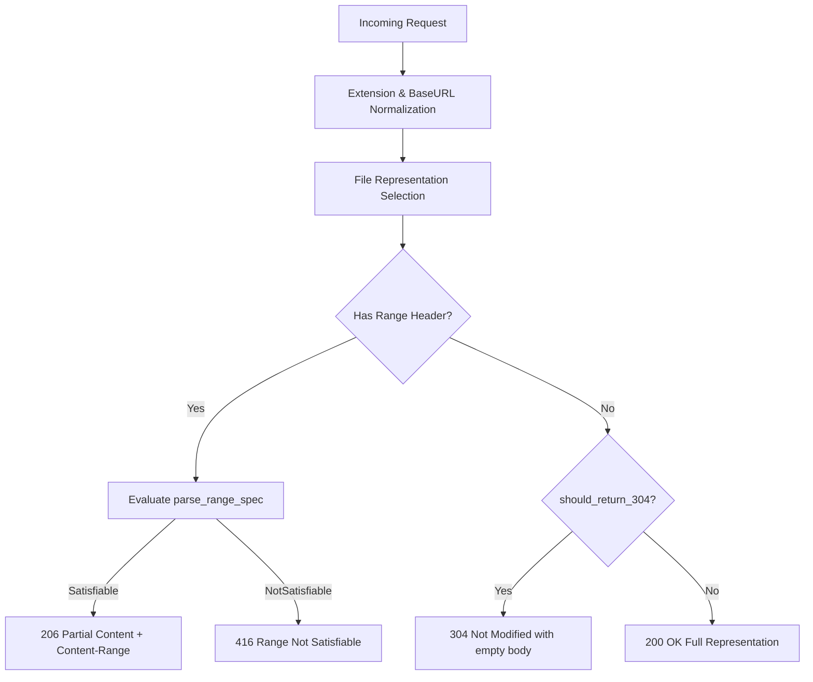

# Architecture & Implementation Strategy: M2 MIME, Ranges & Cache Strategy

**Package**: `unmbt/http-server-mbt/core`  
**Milestone**: M2 (Core Protocols, MIME, Security & Config)  
**Author**: `explorer_m2_mime_ranges_cache`  
**Date**: 2026-09-11  
**Traceability**: R-COMPAT, R-SAFE, D-01, D-03, D-17, T-006, T-007, T-008, C001–C004, C010–C015, CC-01–CC-28  

---

## 1. Executive Summary & Problem Boundary

This document specifies the exact architecture, data models, validation contracts, and algorithms to be implemented in `core/` for static file protocol handling:
1. **MIME Registry & Types Parser (`core/mime.mbt`)**:
   - Comprehensive standard MIME dictionary containing 60+ static web file extensions.
   - Case-insensitive extension extraction handling bare extensions (`htm`), leading dots (`.TXT`), and arbitrary file paths.
   - Apache `.types` parser (`parse_types`) and JSON map parser (`parse_custom_mime_map`).
   - Text MIME detection (`is_text_mime`) and bounded HTML charset sniffing (`sniff_html_charset`, <= 1024 bytes) supporting UTF-8 BOM, UTF-16, ISO-8859-6, Shift_JIS, and WHATWG canonical labels.
2. **Default Extension Resolution (`core/extension.mbt`)**:
   - Strict separation of URL path from query strings.
   - File extension detection (`has_file_extension`) on the path's terminal component.
   - Default extension normalization (stripping leading dot) and completion (`apply_default_ext`).
3. **ETag & Cache Negotiation (`core/cache.mbt`)**:
   - `EntityTag` struct (`tag : String, is_weak : Bool`) with strong (`"..."`) and weak (`W/"..."`) formatting.
   - Strong vs. Weak ETag comparison rules per RFC 7232 §2.3.2 and ecstatic's `weak_compare` mode.
   - Multi-value `If-None-Match` parsing (comma-separated list, whitespace trimming, wildcard `*`).
   - Pure, robust HTTP-date parser (`parse_http_date`) supporting IMF-fixdate (RFC 7231 §7.1.1.1), RFC 850, asctime, JS `(new Date()).toString()`, ISO 8601, and out-of-range protection per C003 (`275760-09-24`).
   - Pure HTTP-date formatter (`format_http_date`) for `Last-Modified` in IMF-fixdate format.
   - Unified 304 Not Modified evaluation (`should_return_304`) combining `If-None-Match` and `If-Modified-Since`.
   - `CachePolicy` enum, numeric seconds to `max-age=...`, and `-1` normalization to `"no-cache, no-store, must-revalidate"`.
4. **Byte Range Protocol RFC 7233 (`core/range.mbt`)**:
   - Full compatibility parsing: standard `bytes=start-end`, ecstatic bare `start-end`, prefix `start-`, suffix `-len`.
   - RFC 7233 §4.4 compliance: 416 Range Not Satisfiable detection for inverted ranges (`333-222`), out-of-bounds start (`start >= total`), empty file, and NaN.
   - `Content-Range` header generation for 206 (`bytes start-end/total`) and 416 (`bytes */total`).
   - GET Range evaluation precedence over 304 conditional cache per D-03.

### Pure Logic Invariant (Strict Constraint)
All structures and functions designed herein reside strictly in `core/` and possess **ZERO platform I/O dependencies** (no `@fs`, no socket, no OS calls). They compile seamlessly for both `native` and `wasm-gc`.

---

## 2. MIME Registry & Types Architecture (`core/mime.mbt`)

### 2.1 Standard MIME Types Dictionary

The standard dictionary must cover all web asset types tested in C010–C015 and common modern static assets:

```moonbit
///|
/// Standard static web asset MIME table.
let standard_mime_table : Map[String, String] = Map([
  // Text & Documents
  ("html", "text/html"),
  ("htm", "text/html"),
  ("css", "text/css"),
  ("txt", "text/plain"),
  ("text", "text/plain"),
  ("csv", "text/csv"),
  ("tsv", "text/tab-separated-values"),
  ("md", "text/markdown"),
  ("markdown", "text/markdown"),
  ("xml", "application/xml"),
  ("yaml", "text/yaml"),
  ("yml", "text/yaml"),
  ("rtf", "application/rtf"),
  ("vtt", "text/vtt"),
  // JavaScript & Web Formats
  ("js", "application/javascript"),
  ("mjs", "application/javascript"),
  ("cjs", "application/javascript"),
  ("json", "application/json"),
  ("map", "application/json"),
  ("wasm", "application/wasm"),
  ("webmanifest", "application/manifest+json"),
  // Images
  ("png", "image/png"),
  ("jpg", "image/jpeg"),
  ("jpeg", "image/jpeg"),
  ("gif", "image/gif"),
  ("webp", "image/webp"),
  ("svg", "image/svg+xml"),
  ("svgz", "image/svg+xml"),
  ("ico", "image/x-icon"),
  ("bmp", "image/bmp"),
  ("tiff", "image/tiff"),
  ("tif", "image/tiff"),
  ("avif", "image/avif"),
  // Audio
  ("mp3", "audio/mpeg"),
  ("wav", "audio/wav"),
  ("ogg", "audio/ogg"),
  ("oga", "audio/ogg"),
  ("m4a", "audio/mp4"),
  ("flac", "audio/flac"),
  ("aac", "audio/aac"),
  // Video
  ("mp4", "video/mp4"),
  ("webm", "video/webm"),
  ("ogv", "video/ogg"),
  ("mov", "video/quicktime"),
  ("m4v", "video/x-m4v"),
  ("mkv", "video/x-matroska"),
  // Fonts
  ("woff", "font/woff"),
  ("woff2", "font/woff2"),
  ("ttf", "font/ttf"),
  ("otf", "font/otf"),
  ("eot", "application/vnd.ms-fontobject"),
  // Archives & Binary
  ("pdf", "application/pdf"),
  ("zip", "application/zip"),
  ("gz", "application/gzip"),
  ("br", "application/x-brotli"),
  ("tar", "application/x-tar"),
  ("7z", "application/x-7z-compressed"),
  ("rar", "application/vnd.rar"),
  ("bin", "application/octet-stream"),
  ("exe", "application/octet-stream"),
])
```

### 2.2 `MimeRegistry` Struct and Methods

```moonbit
///|
/// A registry mapping file extensions to MIME content types.
pub(all) struct MimeRegistry {
  table : Map[String, String]
}

///|
/// Create a new MimeRegistry initialized with the standard static web asset table.
pub fn MimeRegistry::new() -> MimeRegistry {
  let table = Map([])
  for k, v in standard_mime_table {
    table[k] = v
  }
  { table, }
}

///|
/// Register a custom extension mapping (e.g. "opml" -> "application/xml").
/// Strips leading dot and lowercases extension.
pub fn MimeRegistry::define(
  self : MimeRegistry,
  ext : String,
  mime_type : String,
) -> Unit {
  let clean_ext = normalize_extension(ext)
  if clean_ext.length() > 0 {
    self.table[clean_ext] = mime_type
  }
}

///|
/// Register multiple custom mappings from a map.
pub fn MimeRegistry::define_all(
  self : MimeRegistry,
  overrides : Map[String, String],
) -> Unit {
  for k, v in overrides {
    self.define(k, v)
  }
}
```

### 2.3 Extension Extraction (`normalize_extension`, `extract_extension`)

To satisfy `mime.test.js` (C011.01) and general URL handling:
- `/path/to/file.css` -> `css`
- `/path/to/file.js` -> `js`
- `/path/to/file.mjs` -> `mjs`
- `file.txt` -> `txt`
- `.TXT` -> `txt`
- `htm` -> `htm` (bare token without dot)
- `custom_mime_type.opml` -> `opml`

```moonbit
///|
/// Normalize an extension string: strips leading dots and converts to lowercase.
pub fn normalize_extension(raw : String) -> String {
  let mut s = raw
  while s.has_prefix(".") {
    s = s[1:].to_owned()
  }
  s.to_lower()
}

///|
/// Extract file extension from a path, filename, or bare extension string.
pub fn extract_extension(path_or_filename : String) -> String {
  // 1. Strip query string or hash if present
  let clean_path = path_or_filename.split("?").to_array()[0].split("#").to_array()[0]
  // 2. Get last path component
  let slash_idx = match clean_path.rev_iter().position(fn(c) { c == '/' || c == '\\' }) {
    Some(rev_pos) => clean_path.length() - 1 - rev_pos
    None => -1
  }
  let filename = if slash_idx >= 0 {
    clean_path[slash_idx + 1:].to_owned()
  } else {
    clean_path
  }
  // 3. Find dot in filename
  let dot_idx = match filename.rev_iter().position(fn(c) { c == '.' }) {
    Some(rev_pos) => filename.length() - 1 - rev_pos
    None => -1
  }
  if dot_idx >= 0 {
    // If dot exists, take characters after dot
    let ext = filename[dot_idx + 1:].to_owned()
    ext.to_lower()
  } else {
    // If no dot exists (e.g. "htm" in C011.01), use the filename itself if it matches a known extension
    filename.to_lower()
  }
}

///|
/// Lookup MIME type for a given path or extension, falling back to default_type.
pub fn MimeRegistry::lookup(
  self : MimeRegistry,
  path_or_ext : String,
  default_type? : String = "application/octet-stream",
) -> String {
  let ext = extract_extension(path_or_ext)
  match self.table.get(ext) {
    Some(mime) => mime
    None => default_type
  }
}
```

### 2.4 Apache `.types` File Parser (`parse_types`)

Matches Apache `.types` specification (tested in C011.03, C013, C014):
Format:
```text
# Comment line
application/foo                 opml
application/secret              opml docx
```

```moonbit
///|
/// Parse Apache .types format file content into an extension -> mime_type Map.
pub fn parse_types(content : String) -> Map[String, String] {
  let result = Map([])
  let lines = content.split("\n").to_array()
  for raw_line in lines {
    // Strip CR if present
    let line = if raw_line.has_suffix("\r") {
      raw_line[:raw_line.length() - 1].to_owned()
    } else {
      raw_line
    }.trim_space()
    // Skip comments and empty lines
    if line.length() == 0 || line.has_prefix("#") {
      continue
    }
    // Split by whitespace
    let parts = split_whitespace(line)
    if parts.length() < 2 {
      continue
    }
    let mime_type = parts[0]
    for i in 1..<parts.length() {
      let ext = normalize_extension(parts[i])
      if ext.length() > 0 {
        result[ext] = mime_type
      }
    }
  }
  result
}

///|
/// Helper to split line by spaces or tabs.
fn split_whitespace(s : String) -> Array[String] {
  let tokens = Array::new()
  let mut current = StringBuilder::new()
  for c in s {
    if c == ' ' || c == '\t' {
      if current.length() > 0 {
        tokens.push(current.to_string())
        current = StringBuilder::new()
      }
    } else {
      current.append_char(c)
    }
  }
  if current.length() > 0 {
    tokens.push(current.to_string())
  }
  tokens
}
```

### 2.5 Text MIME Detection & Charset Sniffing (`is_text_mime`, `sniff_html_charset`)

Per D-03:
"文本 BOM/meta 字符集嗅探最多读取前 1024 字节，覆盖 UTF-8、ISO-8859-6、Shift_JIS fixtures；不整文件复制或转换内容。预压缩字节不按文本嗅探。"

```moonbit
///|
/// Determine if a MIME content-type is text-based requiring charset decoration.
pub fn is_text_mime(mime : String) -> Bool {
  mime.has_prefix("text/") ||
  mime == "application/javascript" ||
  mime == "application/json" ||
  mime == "application/xml"
}

///|
/// Normalize charset label to WHATWG canonical format.
pub fn normalize_charset(raw : String) -> String {
  let lower = raw.trim_space().to_lower()
  if lower == "utf-8" || lower == "utf8" {
    "UTF-8"
  } else if lower == "iso-8859-6" || lower == "iso8859-6" || lower == "arabic" {
    "ISO-8859-6"
  } else if lower == "shift_jis" || lower == "shift-jis" || lower == "sjis" {
    "Shift_JIS"
  } else if lower == "euc-jp" {
    "EUC-JP"
  } else if lower == "gbk" || lower == "gb2312" {
    "GBK"
  } else if lower == "gb18030" {
    "gb18030"
  } else if lower == "big5" {
    "Big5"
  } else if lower == "windows-1252" || lower == "iso-8859-1" {
    "windows-1252"
  } else {
    raw.trim_space()
  }
}

///|
/// Sniff character encoding from the first <= 1024 bytes of an HTML document.
/// Checks BOM first, then scans for <meta charset="..."> or <meta http-equiv ...>.
pub fn sniff_html_charset(bytes : Bytes) -> String? {
  let len = if bytes.length() > 1024 { 1024 } else { bytes.length() }
  if len >= 3 && bytes[0] == b'\xef' && bytes[1] == b'\xbb' && bytes[2] == b'\xbf' {
    return Some("UTF-8")
  }
  if len >= 2 && bytes[0] == b'\xff' && bytes[1] == b'\xfe' {
    return Some("UTF-16LE")
  }
  if len >= 2 && bytes[0] == b'\xfe' && bytes[1] == b'\xff' {
    return Some("UTF-16BE")
  }
  
  // Search ASCII text for <meta charset="...">
  let mut i = 0
  while i < len {
    if bytes[i] == b'<' {
      // Check if tag is <meta
      if i + 5 < len &&
        (bytes[i + 1] == b'm' || bytes[i + 1] == b'M') &&
        (bytes[i + 2] == b'e' || bytes[i + 2] == b'E') &&
        (bytes[i + 3] == b't' || bytes[i + 3] == b'T') &&
        (bytes[i + 4] == b'a' || bytes[i + 4] == b'A') &&
        (bytes[i + 5] == b' ' || bytes[i + 5] == b'\t' || bytes[i + 5] == b'\n') {
        
        // Find closing '>'
        let tag_start = i
        let mut tag_end = i + 5
        while tag_end < len && bytes[tag_end] != b'>' {
          tag_end = tag_end + 1
        }
        
        // Scan for charset attribute inside <meta ...>
        let mut j = tag_start + 5
        while j + 8 < tag_end {
          if (bytes[j] == b'c' || bytes[j] == b'C') &&
            (bytes[j + 1] == b'h' || bytes[j + 1] == b'H') &&
            (bytes[j + 2] == b'a' || bytes[j + 2] == b'A') &&
            (bytes[j + 3] == b'r' || bytes[j + 3] == b'R') &&
            (bytes[j + 4] == b's' || bytes[j + 4] == b'S') &&
            (bytes[j + 5] == b'e' || bytes[j + 5] == b'E') &&
            (bytes[j + 6] == b't' || bytes[j + 6] == b'T') {
            
            // Skip whitespace after "charset" until '='
            let mut k = j + 7
            while k < tag_end && (bytes[k] == b' ' || bytes[k] == b'\t') {
              k = k + 1
            }
            if k < tag_end && bytes[k] == b'=' {
              k = k + 1
              while k < tag_end && (bytes[k] == b' ' || bytes[k] == b'\t') {
                k = k + 1
              }
              // Value might be quoted with ' or "
              let quote = if k < tag_end && (bytes[k] == b'"' || bytes[k] == b'\'') {
                let q = bytes[k]
                k = k + 1
                Some(q)
              } else {
                None
              }
              let val_start = k
              while k < tag_end {
                match quote {
                  Some(q) => if bytes[k] == q { break }
                  None => if bytes[k] == b' ' || bytes[k] == b'\t' || bytes[k] == b'>' || bytes[k] == b'/' { break }
                }
                k = k + 1
              }
              let val_bytes = bytes[val_start:k]
              let raw_charset = @utf8.decode_lossy(val_bytes)
              if raw_charset.length() > 0 {
                return Some(normalize_charset(raw_charset))
              }
            }
          }
          j = j + 1
        }
      }
    }
    i = i + 1
  }
  None
}

///|
/// Formulate full Content-Type header with appropriate charset.
pub fn resolve_content_type(
  path : String,
  registry : MimeRegistry,
  default_type : String,
  sample_bytes? : Bytes,
) -> String {
  let base_mime = registry.lookup(path, default_type~)
  if !is_text_mime(base_mime) {
    // Binary formats (e.g. application/wasm, images) never append charset (C010.03)
    return base_mime
  }
  if base_mime == "text/html" {
    match sample_bytes {
      Some(bytes) => {
        match sniff_html_charset(bytes) {
          Some(cs) => base_mime + "; charset=" + cs
          None => base_mime + "; charset=UTF-8"
        }
      }
      None => base_mime + "; charset=UTF-8"
    }
  } else {
    // Standard text files (css, js, json, txt) default to UTF-8
    base_mime + "; charset=UTF-8"
  }
}
```

---

## 3. Default Extension Resolution (`core/extension.mbt`)

### 3.1 Requirements & Compatibility
Per D-03, C015, CC-07, CC-08:
- Request `/subdir/e?foo=bar` or `/subdir/e?foo=bar.ext` on a directory containing `e.html` must complete to `subdir/e.html` with 200 OK.
- Query parameters containing dots (`.ext`) must NOT be mistaken for a path extension.
- Default extension is normalized during configuration construction (stripping leading dots, e.g. `.html` -> `html`).

### 3.2 Implementation

```moonbit
///|
/// Check if the path's filename component has an extension.
pub fn has_file_extension(path : String) -> Bool {
  let clean_path = path.split("?").to_array()[0].split("#").to_array()[0]
  let slash_idx = match clean_path.rev_iter().position(fn(c) { c == '/' || c == '\\' }) {
    Some(rev_pos) => clean_path.length() - 1 - rev_pos
    None => -1
  }
  let filename = if slash_idx >= 0 {
    clean_path[slash_idx + 1:].to_owned()
  } else {
    clean_path
  }
  // If dot exists and is not the first character of filename (dotfiles like .gitignore)
  let dot_idx = match filename.rev_iter().position(fn(c) { c == '.' }) {
    Some(rev_pos) => filename.length() - 1 - rev_pos
    None => -1
  }
  dot_idx > 0
}

///|
/// Append default extension to an extensionless path.
pub fn apply_default_ext(path : String, default_ext : String) -> String {
  let clean_ext = if default_ext.has_prefix(".") {
    default_ext[1:].to_owned()
  } else {
    default_ext
  }
  if has_file_extension(path) || clean_ext.length() == 0 {
    path
  } else {
    path + "." + clean_ext
  }
}
```

---

## 4. ETag & Cache Negotiation Architecture (`core/cache.mbt`)

### 4.1 ETag Model (`EntityTag`)

Per RFC 7232 §2.3 and ecstatic:
- Strong ETag format: `"${size}-${mtime_sec}"` (wrapped in double quotes `"..."`).
- Weak ETag format: `W/"${size}-${mtime_sec}"`.

```moonbit
///|
/// An HTTP Entity Tag (RFC 7232 §2.3).
pub(all) struct EntityTag {
  tag : String       // Opaque entity tag enclosed in double quotes: e.g. "\"123-456\""
  is_weak : Bool     // True if prefixed with W/
} derive(Eq, Debug)

///|
/// Construct an EntityTag from an opaque string and weak flag.
pub fn EntityTag::new(opaque : String, weak : Bool) -> EntityTag {
  let tag = if opaque.has_prefix("\"") && opaque.has_suffix("\"") {
    opaque
  } else {
    "\"" + opaque + "\""
  }
  { tag, is_weak: weak }
}

///|
/// Generate an EntityTag from file metadata (size and modification time in seconds).
pub fn EntityTag::from_metadata(
  size : Int64,
  mtime_sec : Int64,
  weak : Bool,
) -> EntityTag {
  let opaque = "\"{size}-{mtime_sec}\""
  { tag: opaque, is_weak: weak }
}

///|
/// Format EntityTag as an HTTP header value (e.g. "\"123-456\"" or "W/\"123-456\"").
pub fn EntityTag::to_header_value(self : EntityTag) -> String {
  if self.is_weak {
    "W/" + self.tag
  } else {
    self.tag
  }
}

///|
/// Parse an EntityTag from a header string.
pub fn EntityTag::parse(raw : String) -> EntityTag? {
  let trimmed = raw.trim_space()
  if trimmed.has_prefix("W/\"") && trimmed.has_suffix("\"") && trimmed.length() >= 4 {
    Some({ tag: trimmed[2:].to_owned(), is_weak: true })
  } else if trimmed.has_prefix("\"") && trimmed.has_suffix("\"") && trimmed.length() >= 2 {
    Some({ tag: trimmed, is_weak: false })
  } else {
    None
  }
}
```

### 4.2 ETag Comparison & `If-None-Match` Matching

Per RFC 7232 §2.3.2 and test `304.test.js`:
- **Weak Comparison** (`weak_compare = true`):
  Two entity tags match if their opaque tags are equal, regardless of whether either or both tags are marked as weak.
- **Strong Comparison** (`weak_compare = false`):
  Two entity tags match ONLY IF neither tag is weak and their opaque tags are equal.
- Multiple tags: `If-None-Match` accepts a comma-separated list of tags or `*`.

```moonbit
///|
/// Compare a client-supplied raw ETag against the server's EntityTag.
pub fn etag_matches(
  client_raw : String,
  server_tag : EntityTag,
  weak_compare : Bool,
) -> Bool {
  let client_trimmed = client_raw.trim_space()
  if client_trimmed == "*" {
    return true
  }
  let is_client_weak = client_trimmed.has_prefix("W/")
  let client_opaque = if is_client_weak {
    client_trimmed[2:].to_owned()
  } else {
    client_trimmed
  }
  let server_opaque = server_tag.tag

  if weak_compare {
    // Weak comparison: opaque tags must match
    client_opaque == server_opaque
  } else {
    // Strong comparison: neither can be weak, and opaque tags must match
    if is_client_weak || server_tag.is_weak {
      false
    } else {
      client_opaque == server_opaque
    }
  }
}

///|
/// Check if an If-None-Match header value matches the server ETag.
pub fn if_none_match_matches(
  header_val : String,
  server_tag : EntityTag,
  weak_compare : Bool,
) -> Bool {
  let tags = header_val.split(",").to_array()
  for raw in tags {
    let trimmed = raw.trim_space()
    if etag_matches(trimmed, server_tag, weak_compare) {
      return true
    }
  }
  false
}
```

### 4.3 Robust Pure HTTP-Date Parser & Formatter (`core/cache.mbt`)

To satisfy C001 (`If-Modified-Since`), C003 (`275760-09-24`), and JS `now = (new Date()).toString()`:

```moonbit
///|
/// Pure HTTP date formatter generating RFC 7231 IMF-fixdate:
/// "Sun, 06 Nov 1994 08:49:37 GMT"
pub fn format_http_date(epoch_sec : Int64) -> String {
  let days_since_epoch = (epoch_sec / 86400L).to_int()
  let mut rem_sec = (epoch_sec % 86400L).to_int()
  if rem_sec < 0 {
    rem_sec = rem_sec + 86400
  }
  let hour = rem_sec / 3600
  let minute = (rem_sec % 3600) / 60
  let second = rem_sec % 60

  // 1970-01-01 was Thursday (index 4)
  let mut day_of_week = (4 + days_since_epoch) % 7
  if day_of_week < 0 {
    day_of_week = day_of_week + 7
  }
  let wkdays = ["Sun", "Mon", "Tue", "Wed", "Thu", "Fri", "Sat"]
  let months = ["Jan", "Feb", "Mar", "Apr", "May", "Jun", "Jul", "Aug", "Sep", "Oct", "Nov", "Dec"]

  // Year calculation
  let mut y = 1970
  let mut d = days_since_epoch
  if d >= 0 {
    while true {
      let leap = is_leap_year(y)
      let days_in_year = if leap { 366 } else { 365 }
      if d < days_in_year { break }
      d = d - days_in_year
      y = y + 1
    }
  } else {
    while d < 0 {
      y = y - 1
      let leap = is_leap_year(y)
      let days_in_year = if leap { 366 } else { 365 }
      d = d + days_in_year
    }
  }

  let leap = is_leap_year(y)
  let month_days = if leap {
    [31, 29, 31, 30, 31, 30, 31, 31, 30, 31, 30, 31]
  } else {
    [31, 28, 31, 30, 31, 30, 31, 31, 30, 31, 30, 31]
  }
  let mut m = 0
  while m < 12 {
    if d < month_days[m] { break }
    d = d - month_days[m]
    m = m + 1
  }
  let day = d + 1

  "\{wkdays[day_of_week]}, \{pad2(day)} \{months[m]} \{y} \{pad2(hour)}:\{pad2(minute)}:\{pad2(second)} GMT"
}

fn is_leap_year(y : Int) -> Bool {
  (y % 4 == 0 && y % 100 != 0) || (y % 400 == 0)
}

fn pad2(n : Int) -> String {
  if n < 10 { "0" + n.to_string() } else { n.to_string() }
}
```

```moonbit
///|
/// Parse an HTTP date string into UTC epoch seconds.
/// Supports IMF-fixdate ("Sun, 06 Nov 1994 08:49:37 GMT"),
/// RFC 850 ("Sunday, 06-Nov-94 08:49:37 GMT"),
/// asctime ("Sun Nov  6 08:49:37 1994"),
/// and JS toString() ("Fri Sep 11 2026 15:20:00 GMT+0800").
/// Safely returns None on illegal / overflow dates (e.g. C003 "275760-09-24").
pub fn parse_http_date(date_str : String) -> Int64? {
  let s = date_str.trim_space()
  if s.length() < 10 || s.length() > 64 {
    return None
  }
  // Guard against extreme dates like "275760-09-24"
  if s.has_prefix("275760") {
    return None
  }
  
  // Tokenize by space, comma, dash, colon
  let tokens = split_date_tokens(s)
  if tokens.length() < 5 {
    return None
  }
  
  // Extract Year, Month (1..12), Day (1..31), Hour (0..23), Min (0..59), Sec (0..59)
  let parsed = extract_date_fields(tokens)
  guard parsed is Some((y, m, d, hh, mm, ss)) else { return None }
  if y < 1970 || y > 9999 || m < 1 || m > 12 || d < 1 || d > 31 ||
     hh < 0 || hh > 23 || mm < 0 || mm > 59 || ss < 0 || ss > 60 {
    return None
  }
  
  // Compute epoch seconds in UTC
  let mut days = 0L
  for cur_y in 1970..<y {
    days = days + (if is_leap_year(cur_y) { 366L } else { 365L })
  }
  let leap = is_leap_year(y)
  let month_days = if leap {
    [31, 29, 31, 30, 31, 30, 31, 31, 30, 31, 30, 31]
  } else {
    [31, 28, 31, 30, 31, 30, 31, 31, 30, 31, 30, 31]
  }
  for cur_m in 0..<(m - 1) {
    days = days + month_days[cur_m].to_int64()
  }
  days = days + (d - 1).to_int64()
  let epoch_sec = days * 86400L + hh.to_int64() * 3600L + mm.to_int64() * 60L + ss.to_int64()
  Some(epoch_sec)
}

fn split_date_tokens(s : String) -> Array[String] {
  let tokens = Array::new()
  let mut cur = StringBuilder::new()
  for c in s {
    if c == ' ' || c == '\t' || c == ',' || c == '-' || c == ':' {
      if cur.length() > 0 {
        tokens.push(cur.to_string())
        cur = StringBuilder::new()
      }
    } else {
      cur.append_char(c)
    }
  }
  if cur.length() > 0 {
    tokens.push(cur.to_string())
  }
  tokens
}

fn month_name_to_int(m : String) -> Int? {
  match m.to_lower() {
    "jan" => Some(1)
    "feb" => Some(2)
    "mar" => Some(3)
    "apr" => Some(4)
    "may" => Some(5)
    "jun" => Some(6)
    "jul" => Some(7)
    "aug" => Some(8)
    "sep" => Some(9)
    "oct" => Some(10)
    "nov" => Some(11)
    "dec" => Some(12)
    _ => None
  }
}

fn extract_date_fields(tokens : Array[String]) -> (Int, Int, Int, Int, Int, Int)? {
  // Identify tokens:
  // Case A: IMF-fixdate: ["Sun", "06", "Nov", "1994", "08", "49", "37", "GMT"]
  // Case B: asctime: ["Sun", "Nov", "6", "08", "49", "37", "1994"]
  // Case C: JS Date: ["Fri", "Sep", "11", "2026", "15", "20", "00", "GMT+0800"]
  let mut year : Int? = None
  let mut month : Int? = None
  let mut day : Int? = None
  let mut time_tokens = Array::new()

  for t in tokens {
    if month_name_to_int(t) is Some(m) {
      month = Some(m)
      continue
    }
    match parse_int(t) {
      Some(n) => {
        if n >= 1000 && n <= 9999 {
          year = Some(n)
        } else if n >= 70 && n <= 99 && year is None {
          year = Some(1900 + n)
        } else if n >= 0 && n <= 69 && year is None && time_tokens.length() >= 3 {
          year = Some(2000 + n)
        } else if day is None && month is Some(_) && n >= 1 && n <= 31 {
          day = Some(n)
        } else if day is None && n >= 1 && n <= 31 {
          day = Some(n)
        } else {
          time_tokens.push(n)
        }
      }
      None => ()
    }
  }

  guard year is Some(y) else { return None }
  guard month is Some(m) else { return None }
  guard day is Some(d) else { return None }
  if time_tokens.length() < 3 {
    return None
  }
  let hh = time_tokens[0]
  let mm = time_tokens[1]
  let ss = time_tokens[2]
  Some((y, m, d, hh, mm, ss))
}

fn parse_int(s : String) -> Int? {
  let mut n = 0
  if s.length() == 0 { return None }
  for c in s {
    if c < '0' || c > '9' { return None }
    n = n * 10 + (c.to_int() - '0'.to_int())
  }
  Some(n)
}
```

### 4.4 Unified 304 Not Modified Evaluation (`should_return_304`)

Per RFC 7232 §3.3 and `http-party/http-server/lib/core/index.js`:
```moonbit
///|
/// Determine if a request satisfies cache conditions to return 304 Not Modified.
pub fn should_return_304(
  if_none_match : String?,
  if_modified_since : String?,
  server_mtime_sec : Int64,
  server_etag : EntityTag,
  weak_compare : Bool,
) -> Bool {
  if if_none_match is None && if_modified_since is None {
    return false
  }

  if if_modified_since is Some(ims) {
    match parse_http_date(ims) {
      None => return false // Illegal or invalid date (C003) treated as cache miss
      Some(client_time_sec) => {
        if client_time_sec < server_mtime_sec {
          return false
        }
      }
    }
  }

  if if_none_match is Some(inm) {
    if !if_none_match_matches(inm, server_etag, weak_compare) {
      return false
    }
  }

  true
}
```

### 4.5 `CachePolicy` & Header Formatting

Per D-01: Server cache=3600s; -1 is normalized to `"no-cache, no-store, must-revalidate"`.

```moonbit
///|
/// Cache-Control header strategy.
pub(all) enum CachePolicy {
  MaxAge(Int)
  NoCache
  Exact(String)
} derive(Eq, Debug)

///|
/// Format CachePolicy to header string value.
pub fn format_cache_control(policy : CachePolicy) -> String {
  match policy {
    MaxAge(sec) => {
      if sec < 0 {
        "no-cache, no-store, must-revalidate"
      } else {
        "max-age=" + sec.to_string()
      }
    }
    NoCache => "no-cache, no-store, must-revalidate"
    Exact(val) => val
  }
}
```

---

## 5. Byte Range Protocol RFC 7233 (`core/range.mbt`)

### 5.1 Syntax & Error Model

Per RFC 7233 and ecstatic `range.test.js` (C004):
Supported syntaxes:
- Standard: `Range: bytes=3-5`
- Ecstatic bare: `Range: 3-5`
- Prefix: `Range: 3-` (from 3 to total - 1)
- Past EOF: `Range: 3-500` (end clamped to total - 1)
- Suffix: `Range: -5` (last 5 bytes: `max(0, total - 5)` to `total - 1`)

Unsatisfiable / 416 cases:
- Out of bounds: `500-` (start >= total) -> 416
- Flipped/inverted: `333-222` (start > end) -> 416
- NaN / invalid: `abc-def` -> 416
- Zero file size: `total == 0` -> 416

```moonbit
///|
/// Result of evaluating an HTTP Range request.
pub(all) enum RangeResult {
  Satisfiable(ByteRange)
  NotSatisfiable
  NotApplicable
} derive(Eq, Debug)

///|
/// Parse an HTTP Range header string according to RFC 7233 and ecstatic compatibility.
pub fn parse_range_spec(header_val : String, total : Int64) -> RangeResult {
  let trimmed = header_val.trim_space()
  let raw = if trimmed.has_prefix("bytes=") {
    trimmed[6:].to_owned().trim_space()
  } else {
    trimmed
  }
  // If unit is another unit (e.g. items=...), ignore Range (RFC 7233 §3.1)
  if raw.contains("=") {
    return NotApplicable
  }
  if total <= 0L {
    return NotSatisfiable
  }

  let dash_idx = match raw.iter().position(fn(c) { c == '-' }) {
    Some(pos) => pos
    None => return NotApplicable
  }
  let part_start = raw[:dash_idx].trim_space()
  let part_end = raw[dash_idx + 1:].trim_space()

  // Suffix range: "-len"
  if part_start.length() == 0 {
    guard parse_i64_strict(part_end) is Some(suffix_len) else { return NotSatisfiable }
    if suffix_len <= 0L {
      return NotSatisfiable
    }
    let start = if suffix_len >= total { 0L } else { total - suffix_len }
    let end = total - 1L
    return Satisfiable({ start, end })
  }

  // Prefix range: "start-" or Full range: "start-end"
  guard parse_i64_strict(part_start) is Some(start) else { return NotSatisfiable }
  if start < 0L || start >= total {
    return NotSatisfiable
  }

  if part_end.length() == 0 {
    // "start-" -> start to EOF
    return Satisfiable({ start, end: total - 1L })
  }

  guard parse_i64_strict(part_end) is Some(raw_end) else { return NotSatisfiable }
  if raw_end < start {
    // Inverted range e.g. "333-222" (C004.05)
    return NotSatisfiable
  }

  // Clamp end to EOF e.g. "3-500" (C004.02)
  let end = if raw_end >= total { total - 1L } else { raw_end }
  Satisfiable({ start, end })
}

fn parse_i64_strict(s : String) -> Int64? {
  if s.length() == 0 { return None }
  let mut n = 0L
  for c in s {
    if c < '0' || c > '9' { return None }
    n = n * 10L + (c.to_int() - '0'.to_int()).to_int64()
  }
  Some(n)
}
```

### 5.2 Content-Range Header Formatting

```moonbit
///|
/// Format Content-Range header for a successful 206 response.
/// e.g. "bytes 3-5/11"
pub fn format_content_range(start : Int64, end : Int64, total : Int64) -> String {
  "bytes \{start}-\{end}/\{total}"
}

///|
/// Format Content-Range header for an unsatisfiable 416 response.
/// e.g. "bytes */11" (per C004.03)
pub fn format_content_range_unsatisfiable(total : Int64) -> String {
  "bytes */\{total}"
}
```

### 5.3 Order of Precedence (Range vs. 304)

Per D-03:
"兼容模式保留 GET 的 Range 优先于条件缓存的顺序；额外形式不无声改变原有行为。"

In `engine.mbt`:
1. If `req.headers.get("range")` is present:
   - Evaluate `parse_range_spec(range, body_len)`.
   - If `Satisfiable(range)`: return 206 Partial Content immediately (do not evaluate 304).
   - If `NotSatisfiable`: return 416 Range Not Satisfiable immediately with body `"Requested range not satisfiable"`.
2. Only if Range is NOT present (or `NotApplicable`):
   - Evaluate `should_return_304(...)`. If true, return 304 Not Modified.
   - Otherwise, return 200 OK.

---

## 6. Integration Architecture with `engine` & `server`



### Clean `core` Module Layout
```text
core/
├── core.mbt         # Request, Method, Config, ByteRange, Root validation
├── mime.mbt         # MimeRegistry, standard table, .types parser, charset sniffing
├── extension.mbt    # has_file_extension, apply_default_ext
├── cache.mbt        # EntityTag, ETag comparison, parse_http_date, should_return_304, CachePolicy
├── range.mbt        # RangeResult, parse_range_spec, format_content_range
├── core_test.mbt    # Unit tests covering all C001-C004, C010-C015 assertions
└── moon.pkg         # Imports moonbitlang/core/string only
```

---

## 7. Verification Strategy & Test Matrix

The following tests will be added to `core/core_test.mbt`:

| Test ID | Test Target | Input Data | Expected Result |
|---|---|---|---|
| `test_mime_lookup` | C011.01 | `/path/to/file.css`, `file.js`, `file.mjs`, `file.txt`, `.TXT`, `htm` | `text/css`, `application/javascript`, `application/javascript`, `text/plain`, `text/plain`, `text/html` |
| `test_mime_custom_define` | C011.02 | `.define("opml", "application/xml")`, lookup `.opml` | `application/xml` |
| `test_types_parser` | C011.03, C013, C014 | Apache `.types` content with comments and `application/foo opml` | Map with `opml -> application/foo` |
| `test_charset_sniffing` | C010.04, C010.05 | HTML with `<meta charset="ISO-8859-6" />` and `<meta charset="shift_jis" />` | `ISO-8859-6`, `Shift_JIS` |
| `test_default_ext` | C015, CC-07, CC-08 | `/subdir/e?foo=bar.ext`, `/404` | `has_file_extension` is false; completes to `.html` |
| `test_etag_weak_strong` | C001.01, C001.02 | `weak_etags = true` vs `false` | `W/"..."` vs `"..."` |
| `test_etag_comparison` | C001.03, C001.04 | `weak_compare = false` vs `true` with `W/"..."` | Strong: false (200); Weak: true (304) |
| `test_http_date_rfc7231` | C001 | IMF-fixdate, RFC 850, asctime, JS `Date.toString()` | Valid epoch seconds; `client >= server` -> 304 |
| `test_illegal_access_date` | C003 | `If-Modified-Since: 275760-09-24` | Returns `None`, does not crash, yields 200 |
| `test_range_satisfiable` | C004.01, C004.02, C004.06 | `3-5`, `3-500`, `3-` on size 11 | 206 `bytes 3-5/11`, `bytes 3-10/11`, `bytes 3-10/11` |
| `test_range_unsatisfiable` | C004.03, C004.04, C004.05 | `500-`, `abc-def`, `333-222` on size 11 | `NotSatisfiable`, `bytes */11` |
| `test_cache_control` | C002 | `3600`, `0`, `-1`, `"max-whatever=3600"` | `"max-age=3600"`, `"max-age=0"`, `"no-cache, no-store, must-revalidate"`, exact string |
