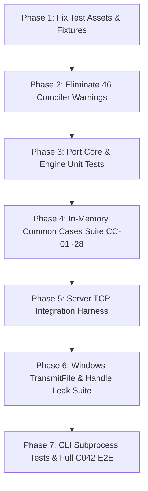

# Test Suite Baseline & Requirements Survey Report

**Author**: `explorer_survey_tests`  
**Date**: 2026-09-11  
**Project**: `unmbt/http-server-mbt`  
**Working Directory**: `D:\project\moonbit\http-server-mbt\.agents\explorer_survey_tests`  
**Baseline References**: `docs/tasks.md` (v4), `docs/design.md` (v4), `docs/windows-baseline.md`, `ORIGINAL_REQUEST.md`, `http-party/http-server` @ `0d3b7bb5b6e8a59fd450ae2dca65870009cfcd8b`

---

## 1. Executive Summary

This investigation surveys the current testing baseline, test cases (C001～C042), fixture suites (CC-01～CC-28, CE-01～CE-02), and test coverage gaps for the MoonBit native `http-server-mbt` project on Windows x86_64.

### Key Findings
1. **Current Test Execution**: Running `moon test --target native` executes **5 tests** across 2 files (`core/core_test.mbt`: 3 tests; `engine_test.mbt`: 2 tests). All 5 pass in ~0.5s.
2. **Missing Package Tests**: The `server` package (`server/server.mbt`) and the CLI package (`cmd/http-server-mbt/main.mbt`) have **0 tests** (0% test coverage).
3. **Migration Deficit (C001～C042)**: None of the original 42 test files (`http-server/test/*.test.js`) are fully ported to the MoonBit test suite. Only minimal subsets of C001, C004, and C008/C015 have basic unit assertions.
4. **Fixture Deficit (CC-01～CC-28, CE-01～CE-02)**: The 28 common fixtures and 2 error fixtures reside in `http-server/test/public` and `http-server/test/fixtures`, but have **not yet been imported or mirrored** into the active project test fixtures (`testdata/public` contains only 2 placeholder files: `hello.txt` and `index.html`).
5. **Windows TransmitFile & IOCP Gaps**: TransmitFile is not yet implemented (current engine reads whole files into memory via `@fs.read_file().binary()`). There are zero tests for kernel zero-copy transfer, Windows handle leaks, client disconnection during transmission, or bounded buffer degradation.
6. **State Machine & Fault Injection (D-18)**: No fault injection framework, fuzzing corpus, or chaos testing exists for chunked inputs, packet fragmentation, or mid-transfer file mutation (D-17).
7. **Code Hygiene & Warnings**: `moon check --target native` passes with 0 errors, but reports **46 compiler warnings** across `engine.mbt`, `engine_test.mbt`, `server/server.mbt`, and `moon.pkg`.

---

## 2. Current Test Suite Inventory & Execution Baseline

### 2.1 Test Execution Output

Command executed:
```powershell
moon test --target native
```

Output:
```text
Total tests: 5, passed: 5, failed: 0.
```

### 2.2 Existing Test Inventory

| File | Package | Test Name | Kind | Assertions & Scope |
|---|---|---|---|---|
| `core/core_test.mbt:3` | `unmbt/http-server-mbt/core` | `normalize base url` | sync unit | Tests `normalize_base_url` on `/`, `docs/`, `/api/v1`, and error on `../x`. |
| `core/core_test.mbt:17` | `unmbt/http-server-mbt/core` | `relative paths reject traversal` | sync unit | Tests `validate_relative_path` rejecting `..`, `\`, `/`, and accepting valid paths. |
| `core/core_test.mbt:27` | `unmbt/http-server-mbt/core` | `byte ranges` | sync unit | Tests `parse_range` on `bytes=0-4`, `bytes=5-`, `bytes=-5` (rejected), `bytes=20-30` (rejected), `bytes=8-2` (rejected). |
| `engine_test.mbt:3` | `unmbt/http-server-mbt` (root) | `static get, head and missing` | async unit | Tests `StaticEngine::handle` with `testdata/public`: GET `hello.txt` (200), HEAD `hello.txt` (0 body), GET `missing` (404). |
| `engine_test.mbt:51` | `unmbt/http-server-mbt` (root) | `range and conditional request` | async unit | Tests `StaticEngine::handle`: Range `bytes=0-4` (206), and subsequent `If-None-Match: <etag>` (304). |

### 2.3 Existing Test Fixtures in `testdata/`

Active `testdata/` directory layout:
```text
testdata/
└── public/
    ├── hello.txt   (14 bytes: "Hello, World!\n")
    └── index.html  (15 bytes: "<h1>Hello</h1>\n")
```

Only these 2 files exist for existing tests. None of the fixtures required for CC-01～CC-28, brotli, gzip, symlinks, special characters, or charset tests are present in `testdata/`.

---

## 3. Original C001～C042 Migration Status Matrix

The following matrix cross-references the 42 original test files from `http-party/http-server` (commit `0d3b7bb5b6e8a59fd450ae2dca65870009cfcd8b`), their requirements in `docs/tasks.md` Section 3, their target test layer, and their current implementation and verification status.

*Layers*: U (Pure Unit), H (Native HTTP / Engine), M (Middleware / In-memory), L (CLI Subprocess), S (System / Lifecycle).  
*Platforms*: A (All platforms: Linux/macOS/Windows), X (POSIX filesystem path fixtures).

### 3.1 Protocol, Cache, Compression & MIME (C001～C015)

| ID | Original Test File | Scope & Preserved Assertions | Layer / OS | Task | Current Status & Gaps |
|---|---|---|---|---|---|
| **C001** | `304.test.js` | .01 strong ETag + IMS -> 304; .02 weak ETag (W/) + IMS -> 304; .03 strong compare; .04 weak compare. | U/H / A | T-007 | **Partial / Missing**: Engine only does exact string match on `If-None-Match`. `If-Modified-Since` is ignored. Weak ETag formatting (`W/`) and comparison logic are not implemented. |
| **C002** | `cache.test.js` | .01 number `3600` -> `max-age=3600`; .02 custom string untouched; .03-.04 dynamic per-request cache function. | U/H / A | T-007 | **Missing**: Engine only supports static `cache_control: String`. Dynamic evaluation, numeric conversion, and function callbacks are absent. |
| **C003** | `illegal-access-date.test.js` | .01 `If-Modified-Since: 275760-09-24` does not crash, returns 200. | U/H / A | T-007 | **Missing**: IMS date parser not implemented; engine ignores IMS header. |
| **C004** | `range.test.js` | .01 `3-5` -> 206; .02 `3-500` -> EOF; .03 `500-`, .04 `abc-def`, .05 `333-222` -> 416 with `bytes */size` & body; .06 `3-` -> EOF; .07 206 preserves cache/etag/mtime. | U/H / A | T-008, T-017 | **Partial**: Basic range 206 exists. Suffix ranges (`bytes=-500`) return None. Content-Range header format on 416 (`bytes */size`) is missing. Headers preservation on 206 not verified. |
| **C005** | `compression.test.js` | .01 br preferred over gzip; .02 br missing -> gzip; .03 br not accepted -> gzip; .04 br disabled -> gzip; .05-.06 neither accepted/enabled -> raw file. | U/H / A | T-008 | **Missing**: Engine has naive `accept.contains("br")` and `accept.contains("gzip")`, but no test covers priority, fallback, or disablement. |
| **C006** | `accept-encoding.test.js` | .01 Accept-Encoding list with whitespace matches gzip; .02 single gzip entry. | U/H / A | T-008 | **Missing**: Header parsing does not split comma-separated tokens or handle q-values; substring search can false-match. Unchecked in tests. |
| **C007** | `force-content-encoding.test.js`| .01 explicit `.br` file with flag off has no encoding header; .02 flag on has `Content-Encoding: br`; .03 regular URL negotiation. | U/H / A | T-008 | **Missing**: `forceContentEncoding` configuration option not present in `core.Config` or `engine.mbt`. |
| **C008** | `core.test.js` | .CC-01～.CC-28: baseDir=base, gzip/autoIndex/showDir enabled, defaultExt=html, handleError=true. | H / A | T-006, T-008, T-009 | **Missing (0/28)**: None of the 28 common cases are tested against the engine. |
| **C009** | `core-error.test.js` | .CE-01, .CE-02: `handleError=false`. Real 404 file is 200; unmatched path delegates to host error handler. | M/H / A | T-015 | **Missing**: Middleware error delegation not tested. |
| **C010** | `content-type.test.js` | .01 text/plain defaults to UTF-8; .02 HTML UTF-8; .03 Wasm application/wasm without charset; .04 ISO-8859-6; .05 Shift_JIS. | U/H / A | T-006 | **Missing**: Engine hardcodes `charset=UTF-8` on 4 MIME types; no charset detection for Arabic/Japanese files; no test. |
| **C011** | `mime.test.js` | .01 7 standard extensions; .02 custom MIME mapping (`opml` -> `application/xml`); .03 `.types` file override & missing file error. | U / A | T-006 | **Missing**: Engine only has hardcoded 7-extension if-else. No custom MIME map, no `.types` parser, no tests. |
| **C012** | `custom-content-type.test.js` | .01 Configuration object specifies MIME mapping (`opml` -> `application/jon`). | U/H / A | T-006 | **Missing**: Config MIME overrides not implemented. |
| **C013** | `custom-content-type-file.test.js` | .01 Non-existent `.types` file raises error before listen; .02 valid file loads mappings. | U/H / A | T-003, T-006 | **Missing**: File loading for MIME types not implemented. |
| **C014** | `custom-content-type-file-secret.test.js` | .01 Dedicated `.types` maps `opml` -> `application/secret`. | H / A | T-006 | **Missing**: Not implemented. |
| **C015** | `default-default-ext.test.js` | .01 Unspecified `defaultExt` completes to `html` (200, `index!!!\n`). | H / A | T-006 | **Partial**: `Config::default` sets `default_ext: Some("html")`, but no test checks the completion behavior on clean URLs without extension. |

### 3.2 Directory, Paths & Security Policy (C016～C030)

| ID | Original Test File | Scope & Preserved Assertions | Layer / OS | Task | Current Status & Gaps |
|---|---|---|---|---|---|
| **C016** | `dir-overrides-404.test.js` | .01 showDir + dirOverrides404 -> 200 with `Index of /directory/`; .02 showDir only -> 404 with custom 404 page body. | H / A | T-009 | **Missing**: `dirOverrides404` not implemented in config or engine. |
| **C017** | `enotdir.test.js` | .01 Appending path after regular file (e.g. `/hello.txt/foo`) -> 404 `File not found. :(`. | U/H / A | T-005 | **Missing**: No test verifying ENOTDIR detection. |
| **C018** | `escaping.test.js` | .01 URL with `curimit%40gmail.com%20(40%25)` resolved to disk directory correctly. | U/H / A | T-005 | **Missing**: Percent decoding in `engine.mbt` does not properly decode UTF-8 byte sequences or test escaped directory paths. |
| **C019** | `pathname-encoding.test.js` | .01 Directory `<dir>` HTML-escaped as `&#x3C;dir&#x3E;`; .02 `%00` NUL does not crash server. | U/H / X, NUL A | T-005, T-009 | **Missing**: `engine.mbt` directory listing generates raw `<li><a href="...">` without HTML entity escaping. XSS vulnerability if directory name contains HTML. |
| **C020** | `malformed.test.js` | .01 Malformed URL `/%` -> 400 Bad Request. | U/H / A | T-005 | **Missing**: `decode_component` raises error, but engine returns `ServerError::Forbidden` (500/403) instead of 400 Bad Request. |
| **C021** | `malformed-dir.test.js` | .01 Malformed query on directory `/?%` -> 400. | U/H / A | T-005 | **Missing**: Query string is split off before decoding in `uri_path`, so `/?%` might bypass decoding check entirely. |
| **C022** | `showdir-href-encoding.test.js` | .01 Filename with `+` rendered as `href="./aname%2Baplus.txt"`. | U/H / A | T-009, T-018 | **Missing**: ShowDir href encoding not implemented. |
| **C023** | `showdir-search-encoding.test.js` | .01 Query parameters in showDir preserved as `href="./subdir/?a=1&#x26;b=2"`. | U/H / A | T-009, T-018 | **Missing**: Query parameter preservation in directory listing not implemented. |
| **C024** | `showdir-with-spaces.test.js` | .01 Directory with spaces accessible and contains `href="./index.html"`. | H / A | T-009, T-018 | **Missing**: Not tested. |
| **C025** | `trailing-slash.test.js` | .01 showDir=false & autoIndex=false -> 404 `File not found. :(` without 302 redirect. | H / A | T-006 | **Missing**: Engine directory handling currently does not issue 302 redirect on missing trailing slash or handle disabled flags properly. |
| **C026** | `headers.test.js` | .01-.04 Custom headers (object, string, array, H array); .05 CRLF injection rejected at init. | U/H / A | T-003, T-010 | **Missing**: Custom headers and CRLF validation not implemented in `Config`. |
| **C027** | `cors.test.js` | .01-.02 Default/false no CORS headers; .03-.04 cors=true -> `Access-Control-Allow-Origin: *`, allowed headers. | U/H / A | T-010 | **Missing**: CORS headers not implemented. |
| **C028** | `coop.test.js` | .01-.02 Default/false no COOP/COEP; .03-.04 coop=true -> `same-origin`, `require-corp`. | U/H / A | T-010 | **Missing**: COOP/COEP headers not implemented. |
| **C029** | `private-network-access.test.js`| .01-.02 Default/false no PNA; .03 true -> `Access-Control-Allow-Private-Network: true`. | U/H / A | T-010 | **Missing**: PNA header not implemented. |
| **C030** | `allowed-hosts.test.js` | .01 Disallowed Host header -> 403; .02 Allowed Host -> 200. | U/H / A | T-010 | **Missing**: Host header whitelist validation not implemented. |

### 3.3 Network, Process, Middleware, Proxy & Integration (C031～C042)

| ID | Original Test File | Scope & Preserved Assertions | Layer / OS | Task | Current Status & Gaps |
|---|---|---|---|---|---|
| **C031** | `localhost.test.js` | .01 localhost, .02 127.0.0.1, .03 `::1` address binding and request success (200). | H/S / A | T-011, T-016 | **Missing**: Server defaults to 0.0.0.0; IPv6 dual-stack or explicit loopback addresses not tested. |
| **C032** | `network-interfaces.test.js` | .01 IPv4 interfaces parsed; .02 fe80 link-local IPv6 excluded. | U/L / A | T-011 | **Missing**: Interface enumeration and display not implemented. |
| **C033** | `process-env-port.test.js` | .01 PORT env var works; .02 9090.86 truncated to 9090; .03-.04 -1, 65536, 65537 exit non-zero. | U/L / A | T-011 | **Partial**: `parse_port` in `main.mbt` checks `n < 1 || n > 65535`, but has no tests for float truncation (`9090.86`) or environment variable precedence. |
| **C034** | `timeout.test.js` | .01-.03 Default/60/0 timeout setup; .04 1000ms idle triggers socket close; .05 normal request works. | H/S / A | T-016 | **Missing**: Socket idle timeout not implemented or tested. |
| **C035** | `express.test.js` | .CC-01～.CC-28 executed in middleware chain, adds `Cache-Control: no-cache`. | M/H / A | T-015 | **Missing**: Middleware integration not tested. |
| **C036** | `express-error.test.js` | .CE-01, .CE-02 in middleware with `handleError=false`. | M/H / A | T-015 | **Missing**: Error propagation not tested. |
| **C037** | `proxy-all.test.js` | .01 Missing target error; .02 proxy overrides local file; .03 404 from upstream. | U/H / A | T-013 | **Missing**: Reverse proxy not implemented. |
| **C038** | `proxy-config.test.js` | .01 Local file not rewritten; .02 `/rewrite/**` prefix stripped, forwarded upstream. | U/H / A | T-013 | **Missing**: Proxy rewrite not implemented. |
| **C039** | `proxy-options.test.js` | .01 HTTPS server with self-signed cert serves local file; .02 proxies unhandled to upstream. | H / A | T-012, T-013 | **Missing**: HTTPS / TLS and proxy options not implemented. |
| **C040** | `websocket-proxy.test.js` | .01 Proxy + WebSocket upgrade forwards messages; .02-.03 no upgrade; .04 unreachable target fails gracefully. | U/H/S / A | T-014 | **Missing**: WebSocket upgrade tunnel not implemented. |
| **C041** | `cli.test.js` | .01 Custom port; .02-.03 custom MIME/types; .04-.06 proxy flags; .07-.10 headers; .11 default content-type. | L/H / A | T-011, T-013 | **Missing**: CLI flags in `cmd/http-server-mbt` only cover `--port`, `--base-url`, `--help`, `--version`. |
| **C042** | `main.test.js` | Full integration suite (21 subcases: static, 404, listing, robots, OPTIONS, auth 401/200, mount prefixes). | H/M/S / A | T-006, T-008, T-009, T-010, T-013, T-015, T-019 | **Missing (0/21)**: Comprehensive E2E test file does not exist. |

---

## 4. Fixture Suites Analysis (CC-01～CC-28, CE-01～CE-02)

### 4.1 Common Cases Contract (CC-01～CC-28)

The 28 common fixtures are specified in `docs/tasks.md` Section 4 and sourced from `http-server/test/fixtures/common-cases.js`:

| ID | Target Path | Request Headers | Expected Status | Content-Type | Body / Location Contract | Status in Target Repo |
|---|---|---|---|---|---|---|
| **CC-01** | `a.txt` | - | 200 | `text/plain` | `A!!!\n` | Missing in `testdata/` |
| **CC-02** | `b.txt` | - | 200 | `text/plain` | `B!!!\n` | Missing in `testdata/` |
| **CC-03** | `c.js` | - | 200 | `application/javascript` | `console.log('C!!!');\n` | Missing in `testdata/` |
| **CC-04** | `d.js` | - | 200 | `application/javascript` | `d.js\n` | Missing in `testdata/` |
| **CC-05** | `e.js` | - | 200 | `application/javascript` | `console.log('π!!!');\n` | Missing in `testdata/` |
| **CC-06** | `subdir/e.html` | - | 200 | `text/html` | `<b>e!!</b>\n` | Missing in `testdata/` |
| **CC-07** | `subdir/e?foo=bar` | - | 200 | `text/html` | Completed to `e.html`, body `<b>e!!</b>\n` | Missing in `testdata/` |
| **CC-08** | `subdir/e?foo=bar.ext` | - | 200 | `text/html` | Query ext does not break completion; `<b>e!!</b>\n` | Missing in `testdata/` |
| **CC-09** | `subdir/index.html` | - | 200 | `text/html` | `index!!!\n` | Missing in `testdata/` |
| **CC-10** | `subdir` | - | 302 | - | `Location: /base/subdir/` | Missing in `testdata/` |
| **CC-11** | `subdir?foo=bar` | - | 302 | - | `Location: /base/subdir/?foo=bar` | Missing in `testdata/` |
| **CC-12** | `%E4%B8%AD%E6%96%87` | - | 302 | - | `Location: /base/%E4%B8%AD%E6%96%87/` | Missing in `testdata/` |
| **CC-13** | `%E4%B8%AD%E6%96%87?%E5%A4%AB=%E5%B7%B4` | - | 302 | - | `Location: /base/%E4%B8%AD%E6%96%87/?%E5%A4%AB=%E5%B7%B4` | Missing in `testdata/` |
| **CC-14** | `subdir/` | - | 200 | `text/html` | Auto-index `index.html` -> `index!!!\n` | Missing in `testdata/` |
| **CC-15** | `404` | - | 200 | `text/html` | Completed to real `404.html` -> `<h1>404</h1>\n` | Missing in `testdata/` |
| **CC-16** | `something-non-existant`| - | 404 | `text/html` | Root `404.html` fallback -> `<h1>404</h1>\n` | Missing in `testdata/` |
| **CC-17** | `compress/foo.js` | `Accept-Encoding: compress, gzip` | 200 | - | Served from `compress/foo.js.gz` | Missing in `testdata/` |
| **CC-18** | `compress/foo_2.js` | - (no gzip header) | 200 | - | Raw uncompressed `compress/foo_2.js` | Missing in `testdata/` |
| **CC-19** | `emptyDir/` | - | 404 | - | Empty directory with no index -> `<h1>404</h1>\n` | Missing in `testdata/` |
| **CC-20** | `subdir_with space` | - | 302 | - | `Location: /base/subdir_with%20space/` | Missing in `testdata/` |
| **CC-21** | `subdir_with space/index.html` | - | 200 | `text/html` | `index :)\n` | Missing in `testdata/` |
| **CC-22** | `containsSymlink/` | - | 404 | - | Symlink resolution disabled -> `<h1>404</h1>\n` | Missing in `testdata/` |
| **CC-23** | `gzip/` | `Accept-Encoding: compress, gzip` | 200 | `text/html` | Body is `gzip/index.html.gz` | Missing in `testdata/` |
| **CC-24** | `gzip/a` | `Accept-Encoding: compress, gzip` | 404 | `text/html` | Root `404.html.gz` | Missing in `testdata/` |
| **CC-25** | `gzip/real_ecstatic` | `Accept-Encoding: compress, gzip` | 200 | `application/octet-stream`| Body is `real_ecstatic.gz` | Missing in `testdata/` |
| **CC-26** | `gzip/real_ecstatic.gz`| `Accept-Encoding: compress, gzip` | 200 | `application/gzip` | Explicit request served as raw `.gz` bytes | Missing in `testdata/` |
| **CC-27** | `gzip/fake_ecstatic` | `Accept-Encoding: compress, gzip` | 200 | `application/octet-stream`| Invalid gzip magic number served raw `ecstatic\n` | Missing in `testdata/` |
| **CC-28** | `gzip/fake_ecstatic.gz`| `Accept-Encoding: compress, gzip` | 200 | `application/gzip` | Explicit request served as raw file | Missing in `testdata/` |

### 4.2 Error Cases Contract (CE-01, CE-02)

| ID | Request | Configuration | Expected Status & Behavior | Status in Target Repo |
|---|---|---|---|---|
| **CE-01** | `/404` | `handleError=false` | 200 (completed to real `404.html`), no-cache in middleware | Missing |
| **CE-02** | `/something-non-existant` | `handleError=false` | Delegates to host Next() before engine writes response; final 404 | Missing |

### 4.3 Fixture Asset Gap Analysis

All reference assets exist in `http-server/test/public` and `http-server/test/fixtures`:
- Directory structures: `another-subdir`, `brotli/`, `charset/`, `compress/`, `curimit@gmail.com (40%)/`, `dir-overrides-404/`, `gzip/`, `show-dir$$href_encoding$$/`, `subdir/`, `subdir_with space/`, `中文/`.
- Files with tricky bytes: `fake_ecstatic` (fake gzip magic bytes), `404.html.gz`, `real_ecstatic.gz`.
- Key TLS assets: `http-server/test/fixtures/https/agent2-cert.pem`, `agent2-key.pem`.
- MIME assets: `custom_mime_type.types`, `custom_mime_type.opml`.

**Finding**: The reference folder `http-server/` is read-only and git-ignored. Per task **T-001**, these fixture directories must be imported into the active project repository (e.g. `testdata/fixtures/` or `testdata/common/`) in an auditable manner, ensuring line endings (LF vs CRLF) and binary byte sequences are preserved without corruption.

---

## 5. Windows Zero-Copy (TransmitFile) & IOCP Testing Requirements

### 5.1 Current Implementation State
- Current `engine.mbt`:
  ```moonbit
  data = Some((@fs.read_file(path) catch { _ => return Error(Io("read failed")) }).binary())
  ```
  All responses read the entire file into memory as a `Bytes` heap object.
- Current `server.mbt`:
  ```moonbit
  conn.send_response(response.status, "OK", extra_headers=out)
  conn.write(response.body)
  ```
  Sends responses through standard user-mode socket write.
- Current `TransmitFile` availability: Win32 `TransmitFile` (from `mswsock.dll`) is **not implemented** in `moonbitlang/async` or this codebase.

### 5.2 Required Test Infrastructure for T-031
1. **TransmitFile Native Binding**:
   - C FFI binding to `TransmitFile(SOCKET hSocket, HANDLE hFile, DWORD nNumberOfBytesToWrite, DWORD nNumberOfBytesPerSend, LPOVERLAPPED lpOverlapped, LPTRANSMIT_FILE_BUFFERS lpTransmitBuffers, DWORD dwFlags)`.
   - File handle lease abstraction (`FileLease`) that keeps the Win32 file handle open during overlapped transmission with `FILE_SHARE_READ | FILE_SHARE_WRITE | FILE_SHARE_DELETE`.
2. **Zero-Copy vs. Bounded Buffer Verification**:
   - Tests comparing byte-for-byte output of `TransmitFile` against standard buffered reads for:
     - Empty files (0 bytes)
     - Standard static files (< 64KB)
     - Large files (> 1MB, > 10MB)
     - 64-bit byte ranges (206 Partial Content)
     - Pre-compressed files (.br, .gz)
3. **Handle Leak Test Suite**:
   - Win32 process handle diagnostic probe using `GetProcessHandleCount(GetCurrentProcess(), &count)` before and after 1,000 rapid file requests to verify handle count does not monotonically increase.
4. **Client Disconnection & Abort Tests**:
   - Client opens TCP connection, requests large file, and forcibly sends TCP RST (`SO_LINGER` with timeout 0) mid-transfer.
   - Test verifies server cleans up IOCP overlapped structure and closes the file handle immediately without crashing or leaking resources.

---

## 6. State Machine, Fault Injection & D-18 Requirements

### 6.1 Current State
- The HTTP parser in `server.mbt` relies directly on `moonbitlang/async/http`, which parses incoming HTTP requests in a single pass.
- No chaos or fault injection mechanisms are wired in.

### 6.2 Required D-18 / T-034 Testing Capabilities
1. **Packet Fragmentation**:
   - Sending HTTP requests split across 1-byte TCP segments, random delays between headers, and malformed CRLF sequences.
   - Verification that request framing, pipeline ordering, and chunk parsing do not hang or corrupt internal state.
2. **Short Writes & Backpressure**:
   - Simulating slow TCP receivers with small window sizes to verify socket write queues remain bounded and do not leak memory buffers.
3. **Mid-Stream File Mutation (D-17 / N-20)**:
   - Modifying or truncating a file while `TransmitFile` or a streamed read is in progress.
   - Verifying that `FILE_CHANGED` does not get treated as EOF, that response terminates cleanly, and that reconnection/retries don't stitch mismatched versions.

---

## 7. Compiler Warnings Baseline (R3 Requirement)

Running `moon check --target native` yields:
```text
Finished. moon: ran 7 tasks, now up to date (46 warnings, 0 errors)
```

The 46 warnings break down into the following 5 distinct categories:

| Category | Warning Code | Occurrences | Location | Cause & Fix Recommendation |
|---|---|---|---|---|
| `redundant_modifier` | `[0008]` | 3 | `engine.mbt:28, 29, 30` | `pub` keyword on fields of a `pub struct`. Remove redundant `pub`. |
| `unused_constructor`| `[0006]` | 2 | `engine.mbt:62, 64` | `NotFound` and `Closed` enum variants in `ServerError` never constructed. Construct or remove. |
| `unused_package` | `[0029]` | 3 | `moon.pkg:2, 4`, `server/moon.pkg:4` | `moonbitlang/async` and `moonbitlang/async/http` imported but unreferenced in those packages. Clean up `moon.pkg`. |
| `deprecated` | `[0020]` | 6 | `engine.mbt:244, 270, 304`, `server/server.mbt:35, 37, 44` | Deprecated `.to_bytes()` (use `@encoding/utf8.encode` or `.to_owned()`), `Show` for debug, `Map::new()` (use `Map([])`). |
| `reserved_keyword` | `[0035]` | 32 | `engine.mbt`, `engine_test.mbt`, `server/server.mbt` | Reserved identifiers `method` and `use` used as field or parameter names. Rename to `meth` / `callback` / `action`. |

---

## 8. Test Architecture & Implementation Roadmap

To fulfill R1, R2, R3, and R4 in `ORIGINAL_REQUEST.md`, testing should be rolled out across the following phases:



### Step-by-Step Action Plan

1. **Step 1: Fixture Asset Consolidation (T-001)**
   - Copy `http-server/test/public` and required fixtures from `http-server/test/fixtures` into `testdata/fixtures/`.
   - Preserve exact byte content, symlink structures, gzip archives, and certificate files.

2. **Step 2: Zero Warnings Remediation (R3)**
   - Resolve all 46 warnings in `engine.mbt`, `engine_test.mbt`, `server.mbt`, and `moon.pkg`.
   - Verify `moon check --target native` reports `0 warnings, 0 errors`.

3. **Step 3: Core & Engine Unit Testing (C001～C007, C010～C015, C016～C025)**
   - Expand `core/core_test.mbt` to cover:
     - Full range parsing (suffix ranges, single-byte ranges, invalid range strings).
     - BaseURL normalization and collision detection (N-01).
     - SPA and try-files path resolution rules (N-02, N-03).
     - Security traversal rejection: Windows drive letters (`C:`), UNC paths (`\\?\`), ADS (`:stream`), percent-encoded traversals (`%2e%2e`), NUL bytes (N-04).
     - Cache-Control and ETag header parsing.
     - MIME type lookup and custom `.types` loading.

4. **Step 4: CC-01～CC-28 & CE-01～CE-02 In-Memory Suite (C008, C009, C035, C036)**
   - Create `engine_common_cases_test.mbt` running all 28 common fixtures against `StaticEngine::handle`.
   - Verify exact status codes, Content-Type headers, Content-Length, Location redirects (302), and body bytes.

5. **Step 5: Server TCP Integration & Lifecycle Test Harness (C031～C034, C042)**
   - Build an in-process native async HTTP client helper (using `@async` and `@socket`).
   - Create `server/server_test.mbt` to test:
     - Real TCP requests over loopback (IPv4 `127.0.0.1` and IPv6 `::1`).
     - Port 0 ephemeral port assignment.
     - `Server::stop()` lifecycle and clean shutdown.
     - Socket idle timeout disconnection (1,000ms idle test).

6. **Step 6: Windows TransmitFile & Handle Leak Testing (T-031, R2)**
   - Create `tests/windows_transmit_file_test.mbt` (or package whitebox test):
     - Test large file (> 5MB) transfer via `TransmitFile`.
     - Test 206 Range transfer via `TransmitFile`.
     - Win32 handle leak test: verify process handle count before and after 500 file transfers.
     - Abort test: verify client disconnect during `TransmitFile` does not leave open handles or hang IOCP.

7. **Step 7: CLI Subprocess Smoke Testing (C041, L layer)**
   - Write integration tests spawning `http-server-mbt.exe`:
     - Test `--help` and `--version`.
     - Test invalid port rejection (`--port nope` and `--port 70000`).
     - Test custom root, `--base-url`, and graceful Ctrl+C termination.

---

## 9. Conclusion

The current test baseline contains only **5 basic unit tests** against 2 temporary fixture files, representing <5% coverage of the target specification.
To achieve full compatibility with the original `http-server` (commit `0d3b7bb5b6e8a59fd450ae2dca65870009cfcd8b`), the project requires:
1. Importing the fixture asset tree into `testdata/fixtures/`.
2. Resolving the 46 compiler warnings to establish a clean 0-warning baseline.
3. Implementing the test suites for CC-01～CC-28, C001～C042, and Windows TransmitFile zero-copy with handle leak verification.
