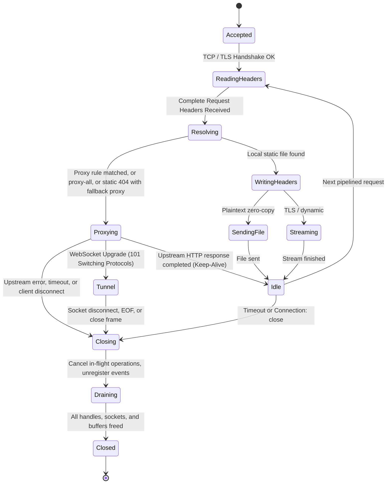

# Specification Mining Report: `min` / `full` Layering, TLS Decoupling, and Reverse Proxy Readiness

**Date**: 2026-09-18  
**Author**: Specification Miner (`spec_miner_survey_1`)  
**Scope**: Project `unmbt/http-server-mbt`  
**Authoritative Sources**:
- `ORIGINAL_REQUEST.md` (Mandate timestamped `2026-09-18T12:00:00Z` and predecessor milestones)
- `docs/design.md` (Version 5, especially D-01, D-02, D-03, D-04, D-05, D-07, D-08, D-11, D-12, D-14, D-15, D-16, D-17, D-18)
- `docs/tasks.md` (Tasks T-011, T-012, T-013, T-014, T-015, T-020, T-027, T-028, and compatibility test suites C001~C042, CC-01~CC-28, CE-01~CE-02)
- `docs/windows-baseline.md` & `docs/progress.md`
- Reference implementation `http-party/http-server` @ `0d3b7bb5b6e8a59fd450ae2dca65870009cfcd8b` (`lib/http-server.js`, `bin/http-server`, `test/proxy-all.test.js`, `test/proxy-config.test.js`, `test/proxy-options.test.js`, `test/websocket-proxy.test.js`, `test/cli.test.js`)

---

## 1. Executive Summary

This specification mining report establishes the authoritative functional and behavioral contracts for three interrelated architectural pillars of `http-server-mbt`:
1. **Reverse Proxy Architecture & Test Parity (T-013 / T-014 / C037~C041)**: Complete contracts for static fallback proxy (`--proxy`), unconditional proxy (`--proxy-all`), rule-based rewrite proxy (`--proxy-config`), upstream options (`proxyOptions`), and WebSocket full-duplex tunneling (`--websocket`), along with the connection state machine transitions, streaming backpressure, error isolation, and configuration constraints.
2. **`min` vs `full` CLI Packaging & Decoupling (R1, R2, D-08, D-15)**: Clear separation of concerns between the zero-crypto lightweight `min` distribution and the full-featured `full` distribution. Specification of CLI argument handling, exit code 1 requirements on unsupported flags in `min`, and decoupling `server` from `tls` via a pluggable `Acceptor` / transport abstraction.
3. **C ABI Public Export Specification (`hs_*`, D-07, D-11)**: Exact API contracts, lifecycle management, versioning, memory ownership rules, error code enum values, asynchronous completion guarantees, and the strict absence of `main` symbol pollution in static and dynamic library artifacts.

---

## 2. Features Discovered

| # | Category | Feature | Description | Inputs | Outputs | Error Behavior | Discovered Via |
|---|---|---|---|---|---|---|---|
| F-01 | Reverse Proxy | Fallback Proxy (`--proxy` / `-P`) | Forwards requests to upstream target when local static file yields 404. If local file exists, serves local file with 200 | Upstream base URL (e.g. `http://127.0.0.1:3000`), incoming HTTP request | Upstream response (status, headers, body) or local static file | Missing scheme or invalid port rejects before listen; unreachable upstream returns 502 without crashing server | `test/proxy-options.test.js` (C039), `lib/http-server.js`:238-259 |
| F-02 | Reverse Proxy | Unconditional Proxy (`--proxy-all`) | Forwards ALL requests directly to proxy target, bypassing local static filesystem check entirely | Boolean flag `--proxy-all`, requires `--proxy` | Upstream response (status, headers, body) | If `--proxy` not set, exit 1 before listen (`--proxy-all requires --proxy`); if combined with `--proxy-config`, exit 1 | `test/proxy-all.test.js` (C037), `bin/http-server`:303-317 |
| F-03 | Reverse Proxy | Rule-Based Proxy (`--proxy-config`) | Maps URL glob patterns to specific upstream targets with regex path rewriting | JSON file path or JSON string mapping path globs to `{ target, pathRewrite }` | Rewritten request forwarded to matched target; unmatched falls through to static | File not found or invalid JSON exits 1 before listen; empty ruleset rejected | `test/proxy-config.test.js` (C038), `bin/http-server`:282-301 |
| F-04 | Reverse Proxy | Upstream Options (`--proxy-options.*`) | Configures upstream proxy client behavior (e.g. `secure: false`, `changeOrigin: true`) | Dotted CLI flags or JSON object | Adjusted upstream request headers, relaxed TLS verification | Specified without a valid proxy target yields `ConfigError` | `test/proxy-options.test.js` (C039), `docs/design.md` D-04, AD-09 |
| F-05 | Reverse Proxy | WebSocket Proxy (`--websocket`) | Upgrades HTTP connection to WebSocket full-duplex tunnel to upstream | HTTP `Upgrade: websocket` header, requires `--proxy` | 101 Switching Protocols + bidirectional byte pipe | If upstream unreachable, returns 502; main server stays alive; invalid port exits before listen | `test/websocket-proxy.test.js` (C040), `docs/design.md` AD-07 |
| F-06 | CLI Packaging | `min` CLI Strict Gatekeeping | 精简版 (min) builds with 0 TLS/proxy dependencies; strictly rejects TLS and Proxy flags | `--cert`, `--key`, `--key-passphrase`, `--proxy`, `--proxy-all`, `--proxy-config`, `--proxy-options`, `--websocket` | Error message to stderr detailing unsupported feature in min build | Immediate exit with code 1; no listener started | `ORIGINAL_REQUEST.md` R2, `docs/design.md` D-08, D-15 |
| F-07 | CLI Packaging | `full` CLI Feature Parity | 完整版 (full) supports all static, routing, TLS, and proxy features | All standard flags + TLS + Proxy flags | Complete HTTP/HTTPS/Proxy service | Invalid configs (bad port, missing cert/key, conflicting routing) exit 1 before listen | `ORIGINAL_REQUEST.md` R2, `docs/design.md` D-08, D-15 |
| F-08 | Architecture | Transport / Acceptor Abstraction | Decouples `server` from `tls` package and MbedTLS C stubs | `Acceptor` interface / trait or pluggable connection wrapper | Plaintext TCP by default; TLS injected in `full` build | Failure during acceptor creation halts before listening | `ORIGINAL_REQUEST.md` R1, `docs/design.md` D-02, D-08 |
| F-09 | C ABI | Version Query (`hs_abi_version`) | Returns ABI major and minor versions to host application | Pointers to `uint32_t major, uint32_t minor` | `HS_OK` (0) and version numbers written to memory | NULL pointers return `HS_ERR_INVALID_ARGUMENT` (-2) | `docs/design.md` D-07, D-11 |
| F-10 | C ABI | Managed Server Lifecycle (`hs_server_*`) | Starts, stops, and releases server instances without host manual polling | JSON config string + length, completion callback, user_data | Opaque `hs_server_t*` handle; asynchronous completion callback | Preflight config error returns `HS_ERR_CONFIG` before listen; double stop safely ignored | `docs/design.md` D-07, D-11 |
| F-11 | C ABI | Managed Engine Lifecycle (`hs_engine_*`) | Embedded static engine for use in foreign frameworks | JSON config string + length | Opaque `hs_engine_t*` handle; asynchronous completion callback | Parse error returns `HS_ERR_CONFIG` | `docs/design.md` D-07, D-11 |
| F-12 | C ABI | Asynchronous Submit (`hs_submit_async`) | Submits HTTP request into engine asynchronously | Method, path, headers array, cancellation token, callback | Opaque `hs_operation_t*` handle; callback receives `hs_response_t*` | Closed engine returns `HS_ERR_CLOSED`; invalid args returns `HS_ERR_INVALID_ARGUMENT` | `docs/design.md` D-07, D-11 |
| F-13 | C ABI | Bounded Response Streaming (`hs_response_read_async`) | Reads response body in bounded chunks with backpressure | `hs_response_t*`, chunk callback, user_data | `hs_chunk_t*` pointer + length | Re-reading before prior chunk finishes returns `HS_ERR_BUSY` (-10) | `docs/design.md` D-07, D-11 |
| F-14 | C ABI | Diagnostic Error Copy (`hs_error_copy`) | Copies human-readable error diagnostics into host-supplied buffer | Error code, output char buffer, buffer capacity | Written length written to `out_len` | Truncates cleanly if buffer too small; never crashes | `docs/design.md` D-07, D-11 |
| F-15 | C ABI | Clean Symbol Export (No `main`) | Exports only `hs_*` public symbols; internal and runtime entry points hidden | Linker export definition / compilation flags | Shared `.dll`/`.so`/`.dylib` and archive `.lib`/`.a` | Symbol collision with host's `main` strictly prevented | `docs/design.md` D-07, D-11, `ORIGINAL_REQUEST.md` R3 |

---

## 3. Edge Cases Discovered

| # | Feature | Input / Condition | Observed & Authoritative Behavior |
|---|---|---|---|
| E-01 | `--proxy` | Missing protocol scheme (e.g. `--proxy google.com`) | Rejected immediately during preflight URL parsing; stderr: `Error: Invalid proxy url`; exit code 1; no TCP port bound (`cli.test.js:107-118`). |
| E-02 | `--proxy` | Port exceeds 65535 or non-numeric (e.g. `--proxy http://127.0.0.1:99999`) | Rejected during config validation (`validate_proxy_url`); raises `ConfigError::InvalidProxy`; exit code 1 before listening (AD-07). |
| E-03 | `--proxy-all` | `--proxy-all` supplied without `--proxy` | Rejected immediately during preflight; stderr: `Error: --proxy-all requires --proxy to be set`; exit code 1 (`cli.test.js:120-131`, `proxy-all.test.js:34-39`). |
| E-04 | `--proxy-all` | Position arguments following `--proxy-all` (e.g. `--proxy-all root_dir --port 8080`) | `--proxy-all` is boolean and must NOT consume `root_dir`; `root_dir` remains positional root argument (`cli.test.js:133-172`). |
| E-05 | `--proxy-all` | Both `--proxy-all` and `--proxy-config` specified simultaneously | Conflicting arguments rejected immediately; stderr: `Error: --proxy-all cannot be used with --proxy-config` with hint; exit code 1 (`bin/http-server:303-312`). |
| E-06 | `--proxy-config` | Config file does not exist, contains invalid JSON, or evaluates to non-object | Stderr: `Error: Invalid proxy config or file`; exit code 1 before listening (`bin/http-server:282-297`). |
| E-07 | `--proxy-config` | File overrides CLI proxy arguments | If valid `--proxy-config` is provided, file config takes precedence; CLI `--proxy` and `--proxy-options` are cleared (`bin/http-server:298-301`). |
| E-08 | Proxy + Fallback | `--proxy` (or `--proxy-all` or `--proxy-config`) combined with `--spa` or `--try-files` | Routing conflict: `ConfigError::ConflictingRouting` raised; exit code 1 before listening (D-04 lines 123-128). |
| E-09 | Proxy + Fallback | Empty `proxy-config` (`{}`) combined with `--spa` | Still rejected as explicit proxy configuration; cannot combine any proxy mode with page fallback (D-04 line 123). |
| E-10 | `--websocket` | `--websocket` supplied without `--proxy` | Upgrade listener is NOT registered (0 listeners); server logs warning and starts regular static serving without failing (`websocket-proxy.test.js:92-118`, C040.02). |
| E-11 | WebSocket Proxy | Valid upstream target but upstream server is down / unreachable | Upgrade handshake fails cleanly; returns 502 Bad Gateway to client; main server remains online; client disconnects with clean resource cleanup (`server.mbt:345-352`, C040.04). |
| E-12 | Reverse Proxy | Upstream returns 404 Not Found | 404 status and upstream error body are streamed directly to client; local 404 handler is bypassed (`proxy-all.test.js:76-79`, C037.03). |
| E-13 | Reverse Proxy | Request matches local file when `--proxy` is set (fallback mode) | Local file served with 200; upstream proxy is NOT called (`proxy-options.test.js:58-65`, C039.01). |
| E-14 | Reverse Proxy | Request matches local file when `--proxy-all` is set | Local file is completely IGNORED; request is forwarded upstream; upstream response returned (`proxy-all.test.js:72-75`, C037.02). |
| E-15 | Reverse Proxy | Upstream connection closes prematurely during response body streaming | Proxy aborts transfer, frees client and upstream sockets; no socket or OS handle leak (0 handle leaks verified via Win32 `GetProcessHandleCount`). |
| E-16 | `min` CLI | User passes `--cert my.crt` or `--key my.key` | Stderr prints explicit error: `--cert is not supported in this build (min build)`; exit code 1; no listener started (D-08, D-15). |
| E-17 | `min` CLI | User passes `--proxy http://127.0.0.1:8080` | Stderr prints explicit error: `--proxy is not supported in this build (min build)`; exit code 1; no listener started (D-08, D-15). |
| E-18 | C ABI | Host calls `hs_server_start_async` with invalid port (> 65535 or < 0) | Request rejected before starting; completion callback invoked with `HS_ERR_CONFIG` (-1); no listening socket opened. |
| E-19 | C ABI | Host calls `hs_response_read_async` while prior read is still pending | Rejected with `HS_ERR_BUSY` (-10); prevents concurrent out-of-order buffer corruption (D-07 line 247). |
| E-20 | C ABI | Host invokes `hs_server_stop_async` while requests are in flight | Stop stops accepting new connections; in-flight requests drained within 5000ms grace period; completion callback called exactly once upon drain finish. |
| E-21 | C ABI | Host calls `hs_submit_async` after `hs_server_stop_async` has been called | Returned error code `HS_ERR_CLOSED` (-8); callback not queued. |

---

## 4. Deep-Dive Specification: Reverse Proxy Architecture (T-013 / T-014)

### 4.1 Configuration Models & Priority Rules

The reverse proxy subsystem supports three operational modes, evaluated in strict order:

```
[Incoming Request]
        │
        ▼
Is --proxy-all enabled?
   ├── YES ──► Forward directly to Upstream (Bypass local filesystem)
   │
   └── NO
        │
        ▼
Is --proxy-config configured?
   ├── YES ──► Does request URL match any glob pattern?
   │              ├── YES ──► Rewrite path (if pathRewrite defined) & Forward to target
   │              └── NO  ──► Fall through to Local Static Engine
   │
   └── NO
        │
        ▼
Execute Local Static Engine (Root + BaseURL)
   ├── File Hit (200 / 206 / 304) ──► Send Local Static Response
   │
   └── File Miss (Static 404)
        │
        ▼
   Is fallback --proxy configured?
        ├── YES ──► Forward request to Fallback Upstream
        └── NO  ──► Return 404 (or Custom 404.html)
```

#### Configuration Struct Design (`core/config.mbt` & `core/proxy.mbt`)

```moonbit
// Glob pattern proxy rule from proxy-config
pub struct ProxyRule {
  pattern : String              // e.g. "/rewrite/**"
  target : String               // e.g. "http://localhost:8082"
  path_rewrite : Array[(String, String)] // e.g. [("^/rewrite", "")]
}

// Proxy options
pub struct ProxyOptions {
  secure : Bool                 // default true; false allows self-signed/invalid certs
  change_origin : Bool          // default true; rewrites Host header to match target
  headers : Map[String, String] // extra headers to inject into upstream request
  timeout_ms : Int              // upstream timeout in milliseconds
}
```

#### Mutual Exclusion Rules (D-04):
1. **Proxy vs Page Fallback**: Any proxy mode (`proxy`, `proxy_all`, or `proxy_config`) is incompatible with page fallback (`spa`, `try_files`). Attempting to set both raises `ConfigError::ConflictingRouting`.
2. **`proxy_all` vs `proxy_config`**: Mutual exclusion. `--proxy-all` cannot be used with `--proxy-config`.
3. **`proxy_all` requires `proxy`**: If `proxy_all` is enabled without a valid `proxy` target URL, configuration fails immediately with `ConfigError::InvalidProxy`.
4. **Target URL Validation**: `proxy` and all rule targets must begin with `http://` or `https://` and have a valid port in range 1..65535.

### 4.2 Connection State Machine Transitions

From `docs/design.md` D-05 (lines 159-184), the state machine for proxy handling is:



### 4.3 Streaming Forward Interface & Backpressure Requirements

1. **Request Streaming**:
   - For incoming `POST` / `PUT` requests with `Content-Length` or `Transfer-Encoding: chunked`, the proxy must stream request body data upstream in chunks without reading the entire payload into RAM.
2. **Response Streaming**:
   - Upstream HTTP response headers are forwarded to the client.
   - Hop-by-hop headers are removed per RFC 9110 (`Connection`, `Keep-Alive`, `Proxy-Authenticate`, `Proxy-Authorization`, `TE`, `Trailers`, `Transfer-Encoding`, `Upgrade` except for WebSocket).
   - `X-Forwarded-For` (client IP appended), `X-Forwarded-Proto` (`http` / `https`), and `X-Forwarded-Host` are added.
   - Upstream body is read in bounded chunks (e.g. 16 KiB - 64 KiB buffer).
   - **Backpressure**: High watermark pauses reading from upstream socket; low watermark resumes reading once the client socket has acknowledged transmission.
3. **Timeout & Error Isolation**:
   - Upstream connection timeout, read timeout, or connection refused emits a structured error.
   - Server sends `502 Bad Gateway` (or `504 Gateway Timeout` on timeout) to client, closes client connection, and releases upstream socket.
   - **Main Server Safety**: No panic, no abort, other client connections completely unaffected.

---

## 5. Deep-Dive Specification: CLI Packaging (`min` vs `full`)

### 5.1 Flag Support Matrix

| Flag / Option | Short | Description | `min` CLI Behavior | `full` CLI Behavior |
|---|---|---|---|---|
| `--port` | `-p` | TCP listen port | Supported (0..65535) | Supported (0..65535) |
| `root` | (pos) | Filesystem root dir | Supported (default: `.`) | Supported (default: `.`) |
| `--base-url` / `--base-dir` | | URL path mount prefix | Supported | Supported |
| `--spa` | | SPA fallback to `index.html` | Supported | Supported |
| `--try-files` | | Custom fallback file | Supported | Supported |
| `--autoIndex` | `-i` | Directory auto-index | Supported (default: `true`) | Supported (default: `true`) |
| `--showDir` | `-d` | Render HTML dir list | Supported (default: `true`) | Supported (default: `true`) |
| `--cache` | `-c` | Cache duration / max-age | Supported | Supported |
| `--cors` | | Cross-Origin headers | Supported | Supported |
| `--auth` | `-a` | Basic Auth credentials | Supported | Supported |
| `--log-ip` | `-l` | Log client IP address | Supported | Supported |
| `--silent` | `-s` | Suppress logs | Supported | Supported |
| `--help` | `-h` | Show help text | Supported | Supported |
| `--version` | `-v` | Show version string | Supported | Supported |
| `--cert` | `-C` | TLS certificate chain | **REJECTED**: Exit code 1, stderr error | Supported (enables HTTPS) |
| `--key` | `-K` | TLS private key | **REJECTED**: Exit code 1, stderr error | Supported |
| `--key-passphrase` | | TLS key passphrase | **REJECTED**: Exit code 1, stderr error | Supported |
| `--tls` / `--ssl` | `-S` | TLS enable flag | **REJECTED**: Exit code 1, stderr error | Supported |
| `--proxy` | `-P` | Fallback proxy URL | **REJECTED**: Exit code 1, stderr error | Supported |
| `--proxy-all` | | Unconditional proxy | **REJECTED**: Exit code 1, stderr error | Supported |
| `--proxy-config` | | Path rewrite rules JSON | **REJECTED**: Exit code 1, stderr error | Supported |
| `--proxy-options.*` | | Upstream proxy options | **REJECTED**: Exit code 1, stderr error | Supported |
| `--websocket` | | WebSocket proxy upgrade | **REJECTED**: Exit code 1, stderr error | Supported |

### 5.2 `min` CLI Error Contract

When any unsupported flag is supplied to `min` CLI, the execution must terminate immediately before binding any network port:

```
$ http-server-min --cert cert.pem --key key.pem
Error: --cert is not supported in this build.
Use http-server-full for TLS/HTTPS and Proxy features.
(Exit code: 1)
```

```
$ http-server-min --proxy http://localhost:3000
Error: --proxy is not supported in this build.
Use http-server-full for TLS/HTTPS and Proxy features.
(Exit code: 1)
```

### 5.3 Decoupling Server from TLS (Pluggable `Acceptor`)

To achieve true decoupling where `min` compiles zero MbedTLS C files:
1. `server` package must remove its import of `unmbt/http-server-mbt/tls`.
2. Define a clean connection handler or acceptor trait/type in `server` (e.g. `ServerAcceptor` or connection interceptor).
3. Plaintext TCP is the default built into `server`.
4. TLS acceptor is packaged separately (e.g., `server/tls_acceptor` or `tls`) and injected into `server` when building `full`.
5. `min` CLI executable targets `cmd/http-server-min` (or builds with min feature profile), linking only `server` and `core`.
6. `full` CLI executable targets `cmd/http-server-full`, linking `server`, `tls`, and proxy modules.

---

## 6. Deep-Dive Specification: C ABI Export (`hs_*`)

### 6.1 Public Header & Export Function Signatures

All exported symbols adhere to the `hs_*` convention. No `main` or runtime initialization functions are exposed:

```c
#ifndef HTTP_SERVER_MBT_H
#define HTTP_SERVER_MBT_H

#include <stdint.h>
#include <stddef.h>

#if defined(_WIN32) || defined(__CYGWIN__)
  #ifdef HS_BUILD_DLL
    #define HS_API __declspec(dllexport)
  #else
    #define HS_API __declspec(dllimport)
  #endif
#else
  #define HS_API __attribute__((visibility("default")))
#endif

#ifdef __cplusplus
extern "C" {
#endif

/* Status / Error Codes */
#define HS_OK                     0
#define HS_ACCEPTED               1
#define HS_NEXT                   2
#define HS_EOF                    3
#define HS_ERR_CONFIG            -1
#define HS_ERR_INVALID_ARGUMENT  -2
#define HS_ERR_IO                -3
#define HS_ERR_UPSTREAM          -4
#define HS_ERR_TIMEOUT           -5
#define HS_ERR_CANCELLED         -6
#define HS_ERR_FILE_CHANGED      -7
#define HS_ERR_CLOSED            -8
#define HS_ERR_LIMIT             -9
#define HS_ERR_BUSY              -10
#define HS_ERR_ABI_MISMATCH      -11

/* Opaque Handle Types */
typedef struct hs_server_s hs_server_t;
typedef struct hs_engine_s hs_engine_t;
typedef struct hs_operation_s hs_operation_t;
typedef struct hs_response_s hs_response_t;
typedef struct hs_chunk_s hs_chunk_t;

/* Callback Function Signatures */
typedef void (*hs_server_callback_t)(void *user_data, int32_t status, int32_t actual_port);
typedef void (*hs_engine_callback_t)(void *user_data, int32_t status);
typedef void (*hs_submit_callback_t)(void *user_data, int32_t status, hs_response_t *res);
typedef void (*hs_read_callback_t)(void *user_data, int32_t status, hs_chunk_t *chunk);

/* Version Query */
HS_API int32_t hs_abi_version(uint32_t *major, uint32_t *minor);

/* Diagnostic Error */
HS_API size_t hs_error_copy(int32_t err_code, char *buf, size_t buf_len);

/* Server API (Standalone Managed HTTP Server) */
HS_API hs_server_t* hs_server_create(const char *config_json, size_t len, int32_t *err_out);
HS_API int32_t hs_server_start_async(hs_server_t *server, hs_server_callback_t cb, void *user_data);
HS_API int32_t hs_server_stop_async(hs_server_t *server, hs_server_callback_t cb, void *user_data);
HS_API void hs_server_release(hs_server_t *server);

/* Engine API (Embedded Request Processor) */
HS_API hs_engine_t* hs_engine_create(const char *config_json, size_t len, int32_t *err_out);
HS_API int32_t hs_engine_submit_async(hs_engine_t *engine, 
                                     const char *method, size_t method_len,
                                     const char *path, size_t path_len,
                                     const char **headers_kv, size_t headers_count,
                                     hs_submit_callback_t cb, void *user_data,
                                     hs_operation_t **op_out);
HS_API int32_t hs_engine_close_async(hs_engine_t *engine, hs_engine_callback_t cb, void *user_data);
HS_API void hs_engine_release(hs_engine_t *engine);

/* Operation Cancellation & Release */
HS_API int32_t hs_operation_cancel(hs_operation_t *op);
HS_API void hs_operation_release(hs_operation_t *op);

/* Response & Chunk Streaming */
HS_API int32_t hs_response_status(hs_response_t *res);
HS_API int32_t hs_response_read_async(hs_response_t *res, hs_read_callback_t cb, void *user_data);
HS_API void hs_response_release(hs_response_t *res);

HS_API const uint8_t* hs_chunk_data(hs_chunk_t *chunk, size_t *out_len);
HS_API void hs_chunk_release(hs_chunk_t *chunk);

#ifdef __cplusplus
}
#endif

#endif /* HTTP_SERVER_MBT_H */
```

### 6.2 C ABI Memory Ownership & Lifecycle Invariants

1. **Allocated by Library, Released by Library**:
   - Handles (`hs_server_t`, `hs_engine_t`, `hs_operation_t`, `hs_response_t`, `hs_chunk_t`) are heap-allocated by the MoonBit runtime / bridge.
   - The host MUST release each handle via its corresponding `hs_*_release()` function.
   - The host MUST NEVER call C `free()` on library pointers.
2. **Buffer Safety**:
   - Host strings (`const char *` with explicit `size_t`) are copied on entry by the library; no dangling pointers across asynchronous hops.
   - Response chunk buffers (`const uint8_t *`) remain valid until `hs_chunk_release()` is called.
3. **Exactly-Once Callback Guarantee**:
   - If an async call returns `HS_ACCEPTED` (or `HS_OK`), the library guarantees that the registered callback will be called EXACTLY ONCE.
   - If an async call returns a failure error code (e.g. `HS_ERR_CLOSED`), the callback will NEVER be called.
4. **No `main` Symbol**:
   - When compiling dynamic libraries (`.dll`) or static archives (`.lib`), the entry point must NOT include MoonBit's or MSVC's runtime `main`.
   - Windows DLL entry point uses `DllMain` (or default CRT DLL startup) without defining `main`.

---

## 7. Verification Method & Acceptance Matrix

| Verification Item | Target Artifact | Tool / Command | Success Criteria |
|---|---|---|---|
| Zero Crypto in `min` Build | `cmd/http-server-min` or min lib | `moon build` / compiler inspection | Zero references to MbedTLS C files in compilation log; binary size drastically smaller than full |
| `min` CLI Flag Rejection | `http-server-min.exe` | Execute with `--cert`, `--key`, `--proxy` | Stderr shows clear rejection message; exit code is exactly 1; no listener started |
| `full` CLI Feature Parity | `http-server-full.exe` | Execute with TLS and Proxy flags | Successfully boots with TLS / Proxy; handles requests |
| Existing Suite Regression | Whole Repo | `moon test --target native` | 183 / 183 tests pass (100% PASS, 0 FAIL) |
| C037 Proxy-all Verification | Server / Proxy Module | Native test suite | All 3 subcases (.01 require target, .02 ignore local files, .03 proxy 404) pass |
| C038 Proxy-config Verification | Server / Proxy Module | Native test suite | Unmatched serves local 200; matched rewrites path and returns remote 200 |
| C039 Proxy-options Verification | Server / Proxy Module | Native test suite | Local hit serves local; local miss falls back to proxy; `secure: false` accepted |
| C040 WebSocket Proxy | Server / Proxy Module | Native test suite | Full-duplex echo passes; invalid port fails before listen; unreachable port does not kill server |
| C041 CLI Proxy Tests | CLI Test Suite | Native test suite | Protocol requirement enforced (exit 1); `--proxy-all` positional args preserved |
| C ABI Export & No `main` | `http_server_mbt_min.dll` / `.lib` | `dumpbin /EXPORTS` or `llvm-nm` | Exports only `hs_*` symbols; `main` symbol strictly absent |
| Minimal C Verification Program | `minimal_c_test.c` | MSVC `cl.exe` / `gcc` | Compiles, links with `hs_*`, prints ABI version, exits 0 |
