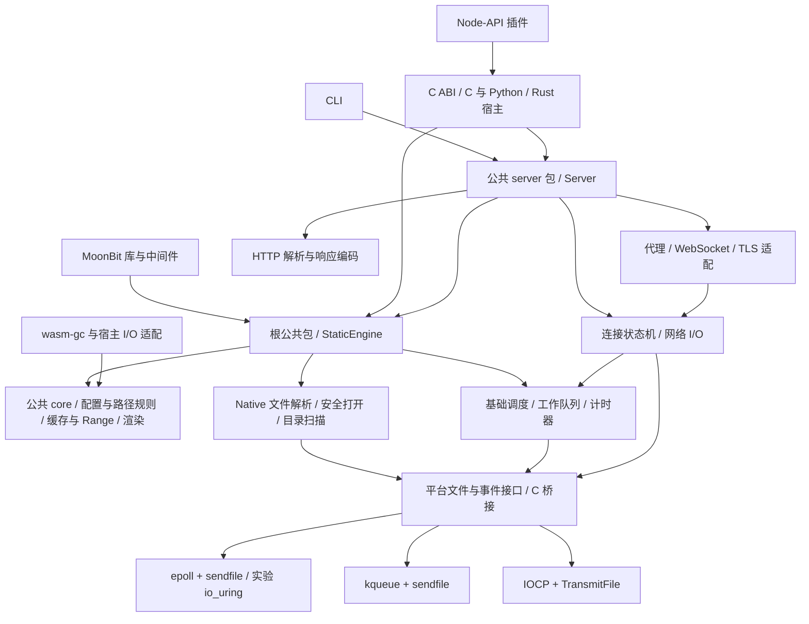
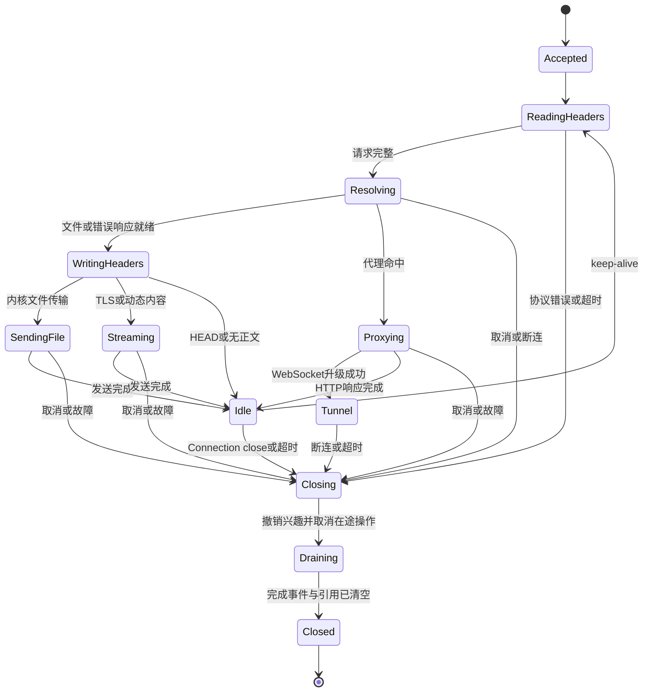

# http-server-mbt 重构设计

版本：4。日期：2026-09-10。更新托管生命周期、单进程高效 I/O，新增 D-17 文件变更和 D-18 故障注入/模糊测试；原量化性能计划撤出，编号保留。本文是待实现契约，需求见 [proposal](proposal.md)，任务与案例见 [tasks](tasks.md)。

**实施前**：阅读 `moonbit-agent-guide`；Native FFI/C ABI 工作另须阅读 `moonbit-c-binding`，按本地工具链核实导出、所有权和链接能力。不要直接修改 `.mooncakes/` 中的依赖缓存。

## D-01 基线、迁移决策与默认值

基线为 `http-party/http-server` 提交 `0d3b7bb5b6e8a59fd450ae2dca65870009cfcd8b`。两个本地参考分析是阅读指南，固定源码与断言才是行为依据。T-001 固定资产哈希、取得方法、许可证和测试环境；当前未安装或运行原版测试，不能报告基线已通过。

### 来源差异记录

| 编号 | 实际来源与差异 | 本设计决策/迁移方式 |
|---|---|---|
| AD-01 | 分析文档列 23 项公共案例，`test/fixtures/common-cases.js` 实际有 28 项 | 全部保留，使用 CC-01～CC-28；core 与 middleware 分别执行，不只移植前 23 项 |
| AD-02 | `lib/core/opts.js` 的 gzip 默认 true，服务入口仅在 `options.gzip === true` 时开启，CLI 默认关闭 | 核心中间件兼容构造保留 gzip=true；Server/CLI 构造默认 false，统一配置对象记录构造来源；Brotli 均默认关闭 |
| AD-03 | `timeout.test.js` 注释有秒/毫秒混用；`lib/http-server.js` 直接把数值交给毫秒接口，默认也传入 120 | 新 API 字段明确为 `idle_timeout_ms`，Server/CLI 默认 120000 ms；CLI `-t` 为秒；迁移显式库数值时按原来的毫秒行为，1000 ms 真实断连必须验证。创建对象的测试不扩写为原来没有的“默认 120 秒已验证” |
| AD-04 | `process-env-port.test.js` 随机上界含 65536，退出回调把数字误当作带 `.code` 的对象 | 固定有效端口范围 0～65535，0 由系统分配；浮点 PORT 9090.86 仍截断为 9090；-1/65536/65537 真实退出码非零且无监听，修正测试夹具而不复制断言缺陷 |
| AD-05 | `pathname-encoding.test.js` 在 Windows 整个文件提前返回，包含 NUL 测试也被跳过 | `<dir>` 实体化文件夹案例仅 POSIX；NUL 防崩及纯 HTML 转义测试在三平台新增，不把 Windows 跳过计作通过 |
| AD-06 | 原版用 Node 的 server 对象、upgrade listener 数量、timeout 事件和 Express next 观察状态 | 映射为本设计的生命周期、upgrade 能力、超时事件/断连和 `Next`/错误委托，保留其 HTTP 和资源断言，不要求 Node 对象布局 |
| AD-07 | WebSocket 错误案例配置端口 99999 后才在连接时出错；已确认的新契约要求配置错误在监听前失败 | C040.04 记录失败时机改变：非法端口返回配置错误且无监听；另用合法但未监听端口验证已开启 upgrade 后的 error/close、不中止主服务。两项均必测，明确这是行为调整，不声称原断言原样通过 |
| AD-08 | 原版根路径前缀检查有源码 TODO，部分递归静态查找会丢失 method；文本字符集嗅探会整文件同步读取 | 路径隔离使用句柄/组件边界；全过程保留 HEAD；嗅探采用有界前缀读取。现有安全和正文断言保留，新增越界、HEAD+Range、大文本内存测试 |
| AD-09 | 分析将 proxy-options 描述为 HTTPS 上游验证，但源码是 HTTPS 代理入口转发到 HTTP 上游；客户端设置 rejectUnauthorized=false | C039 保留真实 HTTPS 入口与本地/代理两条路径；HTTPS 上游验证、SNI 和 secure=false 的实际作用另由 N-12 验证，不冒称原案例已覆盖 |
| AD-10 | 用户确认新增下载期间的文件变更行为，固定原版案例未覆盖并发原地改写的一致性 | D-17 规定检测到修改/截断即终止，重试不跨版本拼接；原有裸 Range 兼容保留，带 If-Range 的续传按可靠验证器匹配，新增 N-20 独立验证 |

除上表及 R-N07 已确认的新行为外，不擅自改变原版断言语义。后续发现差异时补充 AD 记录、对应 C 案例及理由；涉及新的产品取舍再确认，不能删掉失败案例。完整兼容报告必须列出 AD 调整，不能表述为所有原 JS 测试无需修改即可运行。

### 配置归一化

CLI、MoonBit 库和 C ABI 在同一配置层完成解析、默认值、类型转换、别名及交叉校验。CLI 参数覆盖环境变量，环境变量覆盖默认值；不会把一个布尔开关后面的服务根目录吞成开关值。

| 项 | 默认/兼容规则 |
|---|---|
| root | Server/CLI 优先当前目录下存在的 `public`，否则当前目录；位置参数指定 root，核心中间件支持显式 root |
| port / address | 8080；绑定可用双栈地址，系统不支持 IPv6 时使用 IPv4；端口 0 返回实际绑定端口 |
| 目录选项 | autoIndex/showDir/showDotfiles=true，dirOverrides404=false；CLI 的 `-d` 表示目录列表，不能沿用旧 README 将它解释为 root |
| cache / extension | Server cache=3600 秒，-1 归一化为 `no-cache, no-store, must-revalidate`；核心支持字符串及每请求函数；defaultExt=html |
| MIME / ETag | 未知类型 application/octet-stream；weakEtags/weakCompare 默认 true；允许注册 MIME 映射及读取 .types |
| 策略 | Basic Auth、CORS、COOP、PNA、robots、代理、TLS 默认关闭；Host 默认允许所有 |
| idle timeout | `idle_timeout_ms=120000`；CLI `-t 0` 禁用空闲超时，库毫秒值不得乘 1000 两次；其他解析/资源限额不随之关闭 |
| 新功能 | base_url=/；fallback=None；I/O 默认 platform；零拷贝优先自动选择，不支持时有界降级 |

配置错误包含未知选项、缺失参数、非法数值/URI、CRLF、MIME 文件不存在、证书/密钥不可用和 D-04 的冲突。配置/资源预检完成前不监听；CLI 向 stderr 输出可操作错误并退出 1，库返回 `ConfigError`。网卡展示、打开浏览器及日志属于 CLI 适配，不进入静态引擎。

## D-02 包职责与依赖方向

以下为计划包职责，尚未创建源码目录。公开具体类型由 facade 或非 internal 公共包拥有，internal 类型不得泄露到 `.mbti` 或 ABI。

| 包/子系统 | 职责与边界 |
|---|---|
| 根公共包 | Native StaticEngine、静态响应/配置/错误及文档，重导出 core 的共享类型；不引入 CLI、Node-API 或完整 TLS/代理依赖 |
| 公共 core 包 | Native/wasm-gc 共用的请求、元数据、纯配置/路由/缓存/Range/渲染决策；不依赖 Native I/O，类型由此包拥有 |
| 公共 server 包 | 完整 Server、监听/TLS/代理/WebSocket 编排，依赖根静态引擎；调用者显式选择引入 |
| CLI 包 | 参数/环境、帮助/版本、地址日志、信号、浏览器启动、进程退出 |
| internal/http、config、policy | HTTP/1.0、HTTP/1.1 解析/编码，选项别名，认证/头/代理决策；不直接调用平台系统接口 |
| internal/static、listing | Native 根目录边界、文件和目录扫描；调用公共 core 的 MIME/缓存/Range/渲染规则，输出带文件 lease 的响应计划 |
| internal/runtime、platform | slab、缓冲池、队列、计时器、I/O 操作及 C native-stub；基础文件/调度与网络/TLS 分包，根静态 API 不强制链接 TLS；C 不实现整套业务路由 |
| ffi 导出包 | 稳定 C 接口与内部 MoonBit 对象桥接，产物隔离于 CLI 入口 |

依赖单向向下；图中的平台 I/O 由 Native 编排层调用，core 只接收/返回数据和操作意图，不反向导入它。测试可以注入时钟、文件元数据及 I/O 完成事件。早期功能验证允许内部测试驱动使用现有 async；生产数据面遵守 D-05，所有公开使用方式共用业务逻辑。Mooncakes 的三个公共入口见 D-14；wasm-gc 不经根 Native 包进入 core。

## D-03 请求处理与兼容静态语义

请求上下文区分原始 URL、原始 query、归一化路径、去除挂载前缀后的相对路径。内部索引/扩展名/回退查找只改变候选文件，保留原 method、请求头与 URL。

处理顺序：HTTP 报文边界验证 → 日志钩子 → Basic Auth → Host → CORS/PNA/COOP/自定义头 → robots → 显式规则代理/全量代理 → 静态引擎 → 兜底代理或页面回退/错误委托。代理和页面回退的配置互斥，不能运行时猜测优先级。显式代理匹配原始 URL，保留原版按配置顺序首个匹配规则及 pathRewrite 行为；BaseURL 限制本地静态挂载，不对显式代理做隐式前缀剥离。

### 协议与静态表示

- HTTP 增量解析支持分段到达、keep-alive 和有序流水线响应。重复/冲突 Content-Length、TE/CL 歧义、头名/值中的非法控制字符、超长请求拒绝并关闭，不能将下一请求误当正文。初始限额：请求行 8 KiB、头总量 16 KiB、头数量 100；请求缓冲按需申请。请求正文转发采用有界流，静态拒绝方法后须安全处理未读正文或关闭连接。
- URL 百分号编码只解码一次；校验整 URL 编码合法性以覆盖 `/?%`，合法编码的 query 控制字符不当作文件名。路径 NUL、越界分隔符和 Windows 特殊路径形态拒绝；query 保留原表示用于安全的重定向和目录导航。
- 根目录采用已验证目录句柄锚定。规范化后按组件比较，禁止 `/root-other` 字符串前缀绕过；符号链接/reparse point 可在根内解析，越界必须拒绝。Linux 可用 openat2 的约束，其他平台逐组件打开/最终句柄校验；不能仅靠 `realpath` 后再按旧路径打开而留下竞态。
- 先选择实际文件表示，再以同一打开文件句柄的元数据生成长度、修改时间和 ETag，传输也使用该句柄。文件变更检测、中断和重试契约见 D-17；不因有人下载而要求文件写入者等待。Brotli 优先 gzip；gzip 校验魔数；未协商/未启用压缩时发送原文件。显式 .gz/.br 与 forceContentEncoding 按 C007/CC 案例保留区别，不进行动态压缩。
- 文本 BOM/meta 字符集嗅探最多读取前 1024 字节，覆盖 UTF-8、ISO-8859-6、Shift_JIS fixtures；不整文件复制或转换内容。预压缩字节不按文本嗅探。MIME/charset 及转义精确值由迁移案例固定。
- 保留强/弱 ETag、weakCompare 和 If-Modified-Since 组合行为；非法/溢出日期作为缓存未命中。Range 支持原版裸 `3-5` 及标准 `bytes=3-5`，终点截断、越界/NaN/倒置 416 与错误正文按 C004。兼容模式保留 GET 的 Range 优先于条件缓存的顺序；额外形式不无声改变原有行为。
- HEAD 使用 GET 对应状态和头，任何表示与 Range/回退均不写正文；304 同样无正文。自定义 404 保持错误状态，即使正文来自文件；直接请求真实 `404.html` 或扩展名补全命中则是普通 200。

### 目录与错误委托

无页面回退时保留原版的目录/404 优先级，包括默认情况下自定义 404 可能优先于无 index 的目录列表；dirOverrides404 开启后使用相应列表；showDir 与 autoIndex 均关闭时不做无效补斜杠重定向。CC 与 C016 是这组行为的验收依据，不能用“目录总先于 404”简化旧模式。

新页面回退模式采用 D-04 的显式查找顺序。ENOTDIR/ENOENT 是未命中；权限失败、认证失败、路径越界及内部错误是不同错误类型，不能降级为 SPA 成功页。`handleError=false` 将普通未命中作为 `Next`，错误作为结构化错误交给宿主；不提前提交状态、响应头或正文。独立 Server 的最终处理器才把它们转换为 HTTP 响应。

## D-04 BaseURL、SPA 与单文件回退

### 参数与配置冲突

base_url 是 URL 路径前缀；输入 `app`、`/app`、`/app/` 归一化为 `/app`，根保留 `/`。不接受完整 URL、query、fragment、NUL、点段或反斜杠；不将它当作磁盘 root。配置中的非 ASCII 字符允许，URL 输出时按路径组件编码。

| 输入/组合 | 归一化结果或启动行为 |
|---|---|
| 无新参数 | base_url=/，fallback=None，保留原版静态模式 |
| `--base-url /app` 或 `--base-dir app` | 同一个挂载字段；请求 `/app/file` 映射 root/file |
| 同时设置 base-url/base-dir | 归一化值相同允许，不同返回 ConfigError |
| `--spa` | fallback=File(index.html)；布尔参数，不消费后续 root |
| `--try-files site/shell.html` | fallback=File(site/shell.html)；单个 root 相对文件路径 |
| spa 与 try-files 同时设置 | ConfigError，即使指向同一文件也不允许 |
| 页面回退与 proxy / proxy-all / proxy-config | 任一代理模式启用即 ConfigError，包含非空规则代理；指定空 proxy-config 也作为显式代理配置拒绝 |
| proxy-all 无 proxy | ConfigError；proxy 缺 http/https scheme、非法端口同样拒绝 |
| try-files 无值/空值/目录/绝对路径/越界路径 | ConfigError；不支持 `$uri`、`$uri/`、`=404` 或多候选语法 |
| 后端配置 | `--io-backend platform` 默认；`auto`、`epoll`、`kqueue`、`iocp`、`io_uring` 见 D-05 |

配置对象中的 `spa=true` 与任何 `try_files` 值互斥；spa=false 不启用回退。proxyOptions/websocket 只是选项而非独立路由，没有有效 target 时不注册 upgrade；独立指定无意义 proxyOptions 返回配置错误。校验在 CLI、Server、StaticEngine 和 C ABI 共享路径执行；核心中间件构造不接受代理配置，应显式报错而非忽略。

### 请求契约

1. 已通过鉴权和路径安全验证的本地请求，按完整路径组件匹配 BaseURL。`/app` 与 `/app/...` 匹配，`/application` 不匹配；挂载外独立静态响应为 403 空正文，宿主委托模式返回 Forbidden。前缀不约束显式代理路由，见 D-03。
2. 去除挂载前缀后依次尝试实际文件/预压缩表示、无扩展名补全、目录补斜杠、启用的 index 和目录列表。页面回退模式将自定义 404 的渲染延后，因此已有可展示目录优先；合法目录重定向保留 BaseURL 和 query。
3. 只有最终未命中的 GET/HEAD 使用回退文件；不检查 Accept、扩展名或 `/api` 名称。POST/PUT 等不进入回退；CORS 预检仍由前置策略处理。
4. 回退文件相对于 root，与请求子目录无关；内部查找一次，不改浏览器 URL，不重定向、不再次剥离 BaseURL，也不递归触发回退。仍使用文件的 MIME、缓存/Range 和协商表示；正常 GET 为 200，HEAD 无正文。
5. 启动时验证回退文件为根内可读普通文件；运行中每次打开重新验证边界。文件删除为最终 404，不再尝试回退或自定义 404；权限变更为 403，其他 I/O 故障按错误处理。已经安全打开的文件允许按句柄完成响应，后续请求再发现删除。

示例：`root=dist, base_url=/app, --spa` 时，`/app/users/42?tab=a` 内部读取 dist/index.html；`/app/missing.js` 也读取该文件；`/users/42` 为 403；已有 `/app/assets/main.js` 仍发送真实 JS。BaseURL 不重写首页中 `/assets/main.js`，前端构建需设置自己的资源基址。

## D-05 无栈运行时、平台 I/O 与资源生命周期

### 后端契约

以显式操作记录表示 Accept、Read、Write、FileTransfer、FileRead、Stat/Open、Timer、Cancel，完成结果区分完成字节数、WouldBlock、EOF、取消和系统错误。连接 ID 与操作 ID 均带 generation，防止 fd/slab 槽复用后迟到事件写入新连接。上层不依赖 readiness 或 completion 模型差异。

| 平台 | 默认后端 | 文件内核传输 | 异步与降级要求 |
|---|---|---|---|
| Linux | epoll | sendfile，偏移/长度独立于共享文件位置 | 非阻塞 socket；EAGAIN 等待写就绪；文件系统不支持时切换有界 read/write |
| macOS | kqueue | Darwin sendfile | 错误和实际已发送字节同时检查，短写推进偏移；不套用 Linux 调用签名 |
| Windows | IOCP | Overlapped TransmitFile | AcceptEx/异步收发，取消后等待完成包；大于单次 API 长度的文件分段传输 |
| Linux 实验 | io_uring | 按能力使用文件操作/传输组合 | 可运行实现、取消与失败注入；不能把普通异步 send 称为文件零拷贝 |

`platform` 选择当前平台稳定默认。Linux `auto` 在已编入实验功能且探测成功时可选 io_uring，否则 epoll；其他平台 auto 等价 platform。显式指定不属于本平台的后端、未编入的 io_uring 或被内核/沙箱禁止的 io_uring，监听前失败。auto 降级只发生在启动探测阶段；在途操作失败不能无声切换后端而重发数据。

实验后端至少完成监听/接收、收发、文件读取、计时/取消，执行共同协议测试；能力表记录内核版本、探测到的 opcode 和实际传输路径。multishot、registered buffers、SEND_ZC 等分别探测，只在缓冲生命周期和取消测试通过后开启，不作为所有内核的共同能力。默认稳定后端不因实验功能加入而改变。

### 连接状态与调度

先保证单进程高效利用 I/O，状态机不为每个连接创建线程或独立栈。控制块保持紧凑，缓冲、TLS 状态、目录条目和原生操作记录按需申请并计入资源管理。库在内部管理 owner 调度上下文与有界工作队列；宿主无需手动驱动。

多核作为可选实验：可先让有界 C 工作队列处理独立阻塞操作，进一步尝试单进程内隔离的调度分片。必须先验证 runtime 初始化、线程安全、对象隔离与关闭行为；不跨线程共享未经验证的 MoonBit 托管对象，不把多核或多进程 worker 设为首轮前置条件，也不改变默认公共 API。

使用按需 slab 与缓冲池；空闲连接不常驻完整请求/响应缓冲。流输出设高低水位，达到高水位暂停生产/上游读取，降至低水位再恢复。全局缓冲预算和连接上限可配置，预算不足时暂停 accept/分配或返回明确过载结果，禁止无界排队；具体内部块大小由实现验证固化，不作为性能承诺。

调度以有限事件批次和单连接字节预算轮转，防止大文件或巨目录独占循环。以单调时钟维护时间轮/计时器索引，不对所有连接逐轮扫描；通过慢客户端和混合请求验证公平性，不要求宿主反复调用非阻塞 poll。

文件 open/stat/readdir、DNS、可能阻塞的文件读取进入有界原生工作队列；工作线程只操作 C 拥有的数据，不并发进入 MoonBit runtime。非阻塞 socket 不保证冷文件 sendfile 不阻塞：需要文件预取/工作队列隔离可能阻塞的文件操作，测试冷缓存时循环延迟；不能仅测热页缓存就承诺磁盘全异步。每个文件传输同一时刻最多一个在途操作，完成后才续传或取消。

### 传输与清理不变量

- 发送头完成后才能发送正文；短写按实际字节数推进，EINTR 重试，EAGAIN 不重发已完成部分。文件区间使用检查溢出的 64 位 offset/length，覆盖大文件、空文件和 Range。
- TLS 和动态内容使用有界缓冲。TLS WANT_READ/WANT_WRITE 纳入相同调度；一般 TLS 路径不承诺内核零拷贝。代理正文双向背压，WebSocket 升级后透传字节及半关闭，不做无需求的消息解码。
- 客户端断连后撤销 socket 事件、取消文件/上游操作、停止目录生产。取消请求不等于完成；IOCP/io_uring 的缓冲与操作记录必须活到最终完成通知。一个操作只能终结一次。
- 句柄按创建者释放；同一响应持有文件 lease，C 或 MoonBit finalizer 只作兜底，关闭由库自动取消并排空。按 D-17 检测到文件原地修改或截断时立即终止响应，不补零、不切换新句柄续传、不再发送第二个状态行。
- 优雅停止先停止接受连接，在 5 秒默认宽限期内完成已有响应，随后取消并排空；SIGINT/SIGTERM/Windows 控制事件只发停止信号，不在异步信号处理器中进入 MoonBit或进行复杂清理。

## D-06 目录渲染

目录扫描分三步：有界获取条目及元数据 → 目录/文件分类和稳定排序 → 生成转义后的 HTML。压缩伴生文件通过名称集合 O(N) 匹配，排序为 O(N log N)，不能宣传整个排序目录是 O(N)。保留原版目录优先、文件名排序、权限/大小/时间列、图标、点文件选项、query 继承和压缩文件展示语义。

复用带容量提示的 StringBuilder，以写入/流式插值取代逐行拼接临时字符串。字符串输出与 UTF-8 编码采用有界分块，允许一个条目跨块而不截断编码；块消费完即归还缓冲，避免整页的 String → Bytes 双份常驻。排序需要的条目元数据计入资源预算。

元数据任务并发有界，不能随条目数量增长无界启动任务。条目排序存储受全局预算约束：响应尚未提交时预算不足返回 503；提交后不可恢复失败则终止流并清理，不能继续返回损坏 HTML。文件在扫描间消失按原版容错分类处理，目录页的名称和 href 分别做 HTML 与 URL 编码，query 中 `&` 的实体和 `+` 的 URL 转义按 C022/C023 固定。

CSS/图标作为编译期资源随产物嵌入并记录来源许可。静态引擎可返回流式目录响应，CLI 与 C ABI 使用同一渲染器；保持高效实现，不缓存永不过期的整页来代替正确渲染。

## D-07 MoonBit API 与 C ABI

### MoonBit 公共契约

以下为待实现公共语义，具体签名由 T-002/T-015 固化到公共包与生成 `.mbti`，不宣称是当前标准库 API。默认由库托管生命周期，只有两种使用方式：完整服务由宿主传配置并启动/停止；嵌入静态引擎由宿主提交请求、消费异步响应并接入已有 HTTP 框架。pump/run/poll 是内部机制，不进入默认公开接口，也不要求宿主自行等待/唤醒调度器。

| 类型/能力 | 输入与输出 |
|---|---|
| Server | 公共 server 子包拥有；异步 start(config) 在验证且监听就绪后完成并返回实际地址；异步 stop/close 自动停止接受连接、排空及回收，宿主不驱动循环 |
| StaticEngine | 根目录/静态策略与请求；创建后自动管理解析/读取/计时/取消，异步 handle 返回结果，不创建监听 socket |
| Request | method、原始 target、重复头列表及取消信号；静态 GET/HEAD 不要求缓冲完整正文 |
| HandleResult | 异步完成后为 `Handled(Response)`、`Next` 或 `Error(ServerError)`；内部等待不会冒充 Next |
| Response | 状态、头列表和 Empty/Bytes/FileRegion/Stream；默认使用异步有界正文读取，FileRegion 是引擎内部拥有的安全 lease，不把路径或裸句柄交给宿主重新打开/自行驱动传输 |
| CachePolicy | 秒数、完整指令字符串或每请求函数；MoonBit 函数在其所属合法运行上下文执行，错误不得跨 ABI 逃逸 |
| ServerError | 配置、非法请求、禁止、未命中、I/O、上游、超时、取消、预算不足等分类，附可公开上下文 |

Response 在交给传输层前保持未提交，宿主才能实现 middleware fallthrough。库负责文件读取与内部异步，宿主框架负责自己的 socket/TLS 写出，并通过按需读取表达背压；正文异常必须让宿主中止响应，不能伪装 EOF。完整 Server 可在库内使用文件内核传输。默认 API 不暴露裸文件句柄，未来若增加高级传输接口须另写生命周期契约。

纯 MoonBit 消费在应用的合法 MoonBit 异步上下文中由库管理任务；正常 async 调用/等待结果不等于手动驱动事件循环。不能把宿主托管对象直接迁入另一 native runtime 线程。T-002/T-015 必须验证该接入方式，不能把适用于 C 宿主的线程方案直接套用到 MoonBit 宿主。动态 cache 和错误委托保留；C 最小版本只接收声明式配置。

close 一经调用即拒绝新操作，库自动完成停止、取消和排空；调用方可以异步等待 close 结果，但无需循环检查状态。close 完成后无该实例的在途 I/O 或业务回调；未消费正文变为已关闭，已交给宿主的不可变数据有效至其释放。一个实例关闭不终止其他实例。适配器提供显式 close/作用域释放，不能仅依赖 finalizer 时机。

### C ABI v1

导出名统一 `hs_*`，使用 C calling convention，Windows 显式导出、POSIX 限制可见符号；不暴露生成 C 的内部符号。`hs_abi_version()` 返回 major/minor；不透明句柄包含 engine、server、operation、response、chunk。配置使用 UTF-8 JSON 指针加长度，入口复制后由库验证；JSON 中无宿主回调/代码。此次修订替换尚未发布的轮询式草案，T-020 冻结前统一采用托管异步 ABI。

请求与元数据边界使用固定宽度整数及长度明确的 UTF-8 span，重复头为数组。对外结构带 `struct_size` 与 ABI major；不传 MoonBit String/Bytes/闭包/GC 指针，不能假定 C `long` 或 `bool` 的跨平台大小。64 位文件偏移与长度固定为 uint64_t；不可表示到平台 API 的值返回错误。

| 接口族 | 契约 |
|---|---|
| engine_create_async / engine_close_async / engine_release | 自动创建及驱动引擎，close 自动取消排空并通知结果；release 释放外部句柄引用，不替代 close |
| submit_async | 复制请求，返回操作引用；完成通知携带 Handled/Next/错误，宿主不轮询 |
| operation_cancel / operation_release | cancel 提交取消，最终完成通知仍恰好一次；release 仅释放调用方引用，在途内部引用由库保持至终结 |
| response_meta / response_read_async / response_release | 元数据借用至 response_release；按需异步读取返回 chunk、EOF 或错误，每响应最多一个未完成读取，释放响应会停止未完成正文生产 |
| chunk_data / chunk_release | chunk 指针/长度在 release 前有效；由库分配及释放，宿主不得 free，不借用调用方缓冲跨异步调用 |
| server_start_async / server_stop_async / server_release | 启动完成通知保证已验证且监听就绪，停止自动排空；宿主仅配置、启动、停止，不接管监听或循环 |
| error_copy | 将错误码与诊断文本复制到调用方缓冲；长度可查询，不要求宿主调用 free 释放库内存 |

错误分类包括 CONFIG、INVALID_ARGUMENT、IO、UPSTREAM、TIMEOUT、CANCELLED、FILE_CHANGED、CLOSED、LIMIT、BUSY、ABI_MISMATCH；ACCEPTED/NEXT/EOF 是正常结果。BUSY 可表示对同一响应重复提交并行读取，不能要求宿主靠重试 BUSY 来完成关闭。数值及确切头文件由 T-020 冻结；之后兼容项只追加，破坏变更提升 major。库内捕获可恢复错误，避免外部输入走入 panic。

Native C ABI 由库创建并管理内部 owner 线程，同一 runtime 的托管对象只在其合法上下文访问。公共入口通过 C 拥有的线程安全队列、句柄引用和唤醒机制接收不同宿主线程的命令；宿主无需了解 owner 身份，C 工作线程不直接进入 MoonBit。队列接纳后即由库推进；close 与提交竞态以接纳顺序确定，关闭后新提交返回 CLOSED。

异步入口明确区分“拒绝接纳、不会回调”与“已接纳、恰好一次最终回调”。回调及 user_data 保持至最终通知；库在独立于 I/O owner 的内部通知上下文调用 C 回调，不在公共入口内内联调用。回调应只完成轻量通知/排队，可提交新的异步命令，不得同步等待其自身关闭或阻塞通知线程。语言适配器将结果安全转交 Node/Python/MoonBit 的合法上下文，回调不暴露托管对象。

销毁顺序为发起 close/stop → 库自动停止、取消并排空 I/O/已接纳业务通知 → 发出最终关闭通知 → 宿主释放仍持有的 operation/response/chunk/实例句柄 → 最后一个实例关闭时库自动回收内部运行任务/线程。关闭通知后不再回调该实例，其他实例继续工作。缓冲和句柄外部引用未释放前不得卸载动态库；在关闭回调尚未返回时也不得卸载。C/Python 示例覆盖上述顺序，无手动调度循环；Python ctypes 回调只转交结果，资源释放不依赖 Python GC。

宿主通过异步正文接口接入自己的 HTTP 框架，嵌入 Node/Python 等不自动保证端到端零拷贝。最小 ABI 不包含任意宿主 socket 所有权接管；内部 poll/pump、文件句柄和内核操作保持私有。D-12 的 Node 适配将库完成通知映射为 Promise/流，D-14 的 MoonBit 消费直接调用公共包。

## D-08 构建、TLS 与分发

生产服务器编译后端为 Native；wasm-gc 只在 D-13 的实验范围内支持。初始共同发布矩阵为 Linux x86_64、macOS arm64、Windows x86_64；三平台最终能力和验收同等，允许按 D-16 先完成 Windows 本机阶段，再迁入 GitHub Actions。现有 CI 标签/产物名不能证明实际 runner 架构，实施时须固定并记录 OS/CPU。新增架构须补充相同验证，不能仅交叉编译成功就标为可用。

| 产物 | 功能和依赖合同 |
|---|---|
| 精简 CLI | 静态 HTTP、缓存/Range/预压缩、目录、安全策略、BaseURL/回退；裁去 TLS、代理和 WebSocket，相关参数报“此构建不支持”，不能静默忽略 |
| 完整 CLI | 包含全部兼容能力、TLS/HTTP(S) 代理/WebSocket；完整兼容验收只对该形态声明 |
| C 动态库 | 相同静态引擎及声明式 Server 配置；生成独立动态库产物，不把 CLI main 链入库；运行时对象和分配释放留在库内 |
| C 静态库 | `.a`/MSVC `.lib` 与同版 C 头文件、runtime/传递依赖清单；与动态库相同 hs_* ABI，见 D-11 |
| Node 包 | `.node` 静态链接引擎，附 JS/TypeScript 适配；按 OS/架构/libc 分发，不要求额外引擎动态库，见 D-12 |
| wasm-gc | 实验 `.wasm`、宿主接口/适配与运行示例；需要 WasmGC 宿主，不属于无运行时单机 Native 产物 |
| Mooncakes 模块 | `unmbt/http-server-mbt` 可发布源码与必要资源；静态 API、完整 server、可移植 core 分包，独立模块可引入，见 D-14 |
| Linux 静态包 | musl、MoonBit Native runtime 与第三方依赖一同链接，无 PT_INTERP/DT_NEEDED；不得在首次 TLS/DNS 时动态加载额外库 |
| macOS 独立包 | 允许系统 libSystem 等框架；第三方 TLS/runtime 随构建链接，不依赖 Homebrew 或用户安装动态库 |
| Windows 独立包 | CRT 策略避免要求用户安装额外 redistributable；仅依赖目标系统自带 DLL；DLL 与宿主不能跨 CRT 交叉 free |
| Docker min/full | 分别封装精简/完整 Linux 静态 CLI；默认 Distroless static nonroot 基础层，保留 scratch 变体；功能、标签与验收见 D-15 |

TLS 选用静态链接的受支持 OpenSSL 3 稳定系列，T-002/T-012 固定具体补丁版本、源码哈希、构建选项和许可证，并验证三平台可链接性；不继承当前 async Unix 动态加载 OpenSSL 的实现。所需 provider 随库链接，不要求外部 provider 模块或系统 OpenSSL 配置。TLS 握手、证书/私钥/passphrase、上游 SNI、主机名与证书校验纳入测试；`secure=false` 仅在显式配置时关闭上游验证。

完整包内嵌有来源/版本记录的信任根 bundle，支持显式 CA 配置覆盖；证书、私钥和站点文件属于部署数据，不是语言运行时依赖。精简包不携带 TLS 信任根。静态 Linux 的 DNS/localhost 与 IPv6 行为在最小环境实测，不能用“链接成功”证明无运行依赖。

MoonBit 版本、C 编译器、目标 triple、TLS 与资源哈希、链接选项、strip/LTO 状态均记录到构建清单。现有 CI 先由 T-032 扩展基础矩阵，再由 T-025 完成全部门槛；README/发布声明由 T-022/T-025 更新，本次不改工作流。Linux 使用 readelf/ldd 等检查依赖，macOS 使用 otool，Windows 使用 PE import 检查；动态库允许操作系统加载器，但不以可执行文件的全静态规则错误验收 `.so`。

## D-09 高性能原则与历史编号

保证高性能，以单进程高效 I/O、按需分配、有界队列、背压和高效集合/渲染算法落实。多核仅作可选实验，默认公共 API 保持托管生命周期。本轮不设量化性能目标，不要求专项基准、性能报告工作流或新增指标端点。

下列编号及 T-024 自版本 4 起撤出当前范围，仅保留追踪，不再构成功能完成或发布门槛。原有依赖清单、资源正确释放、实际内核传输和公平性验证仍分别由 D-08、N-05/N-06/N-08/N-19 承担。

| 历史 ID | 状态 |
|---|---|
| P-01 产物基准 | 已撤出当前范围，保留编号 |
| P-02 启动基准 | 已撤出当前范围，保留编号 |
| P-03 内存基准 | 已撤出当前范围，保留编号 |
| P-04 连接规模基准 | 已撤出当前范围，保留编号 |
| P-05 目录基准 | 已撤出当前范围，保留编号 |
| P-06 传输基准 | 已撤出当前范围，保留编号 |

## D-10 测试分层、追踪与交付证据

所有 C001～C042 源文件及其子案例映射位于 [tasks 的迁移矩阵](tasks.md#compatibility)。共享 fixtures 使用 CC/CE 编号；计数按“源文件、逻辑案例、目标平台实例”分别报告，42 是文件数而非测试数量。每个目标测试名或注释包含源案例 ID；原版正文与头字段断言使用等价字节/文本断言，eol 归一化只用在原测试已有的地方，压缩文件不转码。

层次标记：U=纯函数/配置测试，H=真实 Native HTTP，M=无监听宿主中间件，L=CLI 子进程，F=C ABI 外部进程，S=系统/生命周期；P 只保留为历史基准层。三平台为 A；仅 POSIX 特殊文件名为 X；IPv6、symlink、权限等能力缺失需逐项记录，不能跳过整个功能域。CI 应具备验证各平台必需能力的执行器。

### 新增契约测试组

| 组 ID | 场景及必须验证的结果 | 需求 / 任务 |
|---|---|---|
| N-01 | BaseURL 独立、根/子路径、中文/空格、组件边界、别名等值/冲突、query/重定向、挂载外 403、代理不隐式剥前缀 | R-N07 / T-019 |
| N-02 | spa/try-files 各自及与 BaseURL 组合；GET/HEAD、Accept 缺省/非 HTML、缺失 JS/API、真实文件/扩展名/目录优先、内部一次回退、自定义 404 优先级变化 | R-N07 / T-019 |
| N-03 | spa+try-files、各代理组合、空/越界/不可读回退文件；CLI 退出 1 且端口无监听，库/ABI ConfigError；运行中删除为最终 404、权限变更为 403 | R-N07、R-SAFE / T-003、T-019、T-020 |
| N-04 | 单/双编码 traversal、根目录前缀碰撞、symlink/reparse 竞态、Windows 盘符/UNC/ADS、NUL、CRLF/XSS；不暴露 root 外数据，错误不进入回退 | R-SAFE / T-004、T-005、T-010 |
| N-05 | partial read/write、EINTR/EAGAIN、64 位偏移、大文件/截断、Range、HEAD+Range、TLS降级、慢接收；字节无重复/缺失，缓冲有界；T-031 先验证 Windows 明文子集，T-017 完成三平台全部适用场景 | R-N01 / T-031、T-017 |
| N-06 | 资源限额、背压、公平性、超时、半关闭、取消晚完成、generation 复用、内部停止排空、FD/handle/内存回收 | R-N03、R-N04、R-SAFE / T-016 |
| N-07 | io_uring 真实可用、未编入、ENOSYS/EPERM/opcode 缺失、auto 降级、显式强制失败、在途取消；跑共同 H/S 测试 | R-N04 / T-023 |
| N-08 | 巨目录排序/压缩匹配/转义、条目消失、输出跨块、多字节字符、慢客户端/中途断连、预算耗尽，无整页双份缓冲 | R-N05 / T-018 |
| N-09 | ABI major/struct_size、UTF-8 与嵌入 NUL、输入复制、元数据/chunk 有效期、并发入口、接纳与回调次数、取消自动排空、重复创建/销毁、卸载边界、C/Python 一致 | R-N06、R-N14 / T-020、T-021 |
| N-10 | 三平台干净环境 CLI、TLS/DNS 无第三方运行库、Linux 静态检查、scratch 非 root/只读数据/SIGTERM、DLL 无 CLI main | R-N02 / T-012、T-022 |
| N-11 | HTTP 分片报文、TE/CL 歧义、限额、keep-alive、流水线顺序、HEAD/304 无正文、拒绝方法时未读正文隔离 | R-SAFE / T-004、T-016 |
| N-12 | HTTPS 握手与 passphrase、证书错误、secure=false 显式例外、代理双向背压、有效端口上游断连及 WebSocket 半关闭不杀主进程 | R-COMPAT、R-SAFE / T-012、T-013、T-014 |
| N-13 | 静态库被独立 C/Rust 程序链接、执行及关闭；同 ABI 与动态库结果一致，传递依赖齐全、无 CLI main/重复 runtime、PIC 可供 .node 使用，MSVC 静态 .lib 与 import library 区分 | R-N08 / T-027 |
| N-14 | Node 导入、Promise/流式正文/Next、背压/AbortSignal、空闲主循环响应、多 napi_env/Worker 清理、重复实例/关闭、支持 Node 版本及各平台预构建命中/不支持目标报错 | R-N09 / T-028 |
| N-15 | wasm-gc 真实构建/装载、宿主能力缺失、异步完成/取消竞态、目录多块与文件 token 回收；共享配置/路由/缓存/Range/渲染案例对照 Native，未支持能力明确报错 | R-N10 / T-029 |
| N-16 | 独立 MoonBit 消费模块从候选包/已发布 registry 引入；公共类型/方法可用、StaticEngine 无监听和 CLI 副作用、GET/HEAD/Range/目录/Next/BaseURL/SPA，native-stub/资源齐全，core 的 wasm-gc 导入不拉入 Native I/O | R-N11 / T-030 |
| N-17 | Distroless/scratch × min/full 的功能矩阵、镜像内 CLI 哈希、非 root/只读挂载、无 shell 启动、外部 HTTP 就绪探测、SIGTERM 排空、错误配置、full TLS/代理/WebSocket、min 拒绝裁去功能；分别报告基础层/镜像体积 | R-N12、R-N02 / T-022、T-025 |
| N-18 | GitHub Actions 三平台真实构建/运行/打包和消费验证、原版及迁移分母、失败 job 阻止发布、缺失 artifact/必需测试阻止完成、正确 runner 架构、干净缓存可复现；本机阶段与最终三平台结果分开 | R-N13 / T-031、T-032、T-025、T-026 |
| N-19 | 两种托管模式均不手动推进循环；启动就绪/预检失败、请求异步完成/背压、跨线程命令、停止与提交竞态、关闭自动排空、多实例隔离、无关闭后回调；MoonBit/C/Node/Python 与 wasm-gc 适配的各自上下文合法 | R-N14 / T-002、T-015、T-016、T-020、T-021、T-028～T-030 |
| N-20 | 下载期间原地同长度改写/增长/截断、路径替换/删除、Range/预压缩/TLS、检测迟到与在途取消；FILE_CHANGED 不作 EOF、写入不等待下载、自动重试丢弃旧内容并从头请求、If-Range 不跨版本拼接、元数据缓存失效 | R-N15 / T-033 |
| N-21 | HTTP 随机分片/非法报文、模型事件调度、短写/故障/取消与完成乱序、generation 复用、文件变更及关闭回调竞态；固定种子可复现、语料最小化、ASan/平台检查及三平台回归 | R-N16、R-SAFE / T-034、T-025 |

实现任务完成证据包含：R/D/T/C/N/P 编号、提交、目标平台/构建形态、完整命令、成功/失败/跳过数及原因、相关日志/报告位置。MoonBit 修改运行 `moon check --target native`、相关 `moon test --target native`，最后 `moon info --target native` 与 `moon fmt` 并审查接口变化；FFI/传输增加 ASan/UBSan 或对应平台可用的内存/句柄检查，缺少工具须记录覆盖缺口。

纯文档阶段只验证链接、需求和任务引用、矩阵覆盖、未完成状态及契约一致性，不运行会修改源码/接口的命令。后续正式发布按形态验证适用 C/N 测试、三平台 Native 资源/分发和各宿主消费；完整 Native 包继续承担全量兼容，io_uring/wasm-gc 明确标实验。撤出的历史 P/T 计划不影响当前验收分母。

## D-11 静态库与 Native 导出前置条件

此次查阅的 [MoonBit 官方导出说明](https://docs.moonbitlang.com/en/latest/language/ffi.html#export-functions)指出 Native 尚不能直接将 `foreign_library` 输出为可链接库，包含共享库。此为在线文档能力说明；本地工具链版本须在 T-002 实测。`extern "c"` 的调用能力、C 源码存在和 hs_* 符号设计均不能单独证明库产物可用。

T-002 验证路径为：固定支持 C 生成的工具链/编译模式 → 导出桥接入口与 runtime 初始化 → 将生成 C/native-stub/runtime 编译为对象 → 外部归档为静态库或链接为动态库。自动化使用 `.mbtx` 驱动编译器/archiver；不手改生成 C，不以易变内部符号作为用户 ABI。若固定工具链无法可靠保留入口或初始化 runtime，记录证据并将库/Node 相关任务置为阻塞，其他独立工作继续；不能用未验证 shell 链接配方宣告完成。

同一探针还须验证 D-07 的托管启动/关闭：库内部 owner 的创建与初始化、跨线程 C 命令队列、完成通知、自动排空及多实例引用。C ABI 静态/动态库与 MoonBit 直接消费分别验证；不把宿主已有 runtime 的托管值迁到库新建线程。无法实现托管时记录阻塞并修正内部方案，不能改成要求用户手动轮询来通过验收。

正式静态产物与动态库共用 C 头文件、hs_* 版本、错误码及 D-07 所有权；Linux/macOS 为 `.a`，Windows MSVC 为静态 `.lib`，MinGW 为 `.a`。Windows 的 DLL import library 必须使用明确的 import 名称，不能冒充真正静态 archive。Rust 消费通过 C ABI 与 Cargo 链接配置，不输出依赖 Rust 编译器私有 ABI 的 `.rlib`；Rust 官方的[原生库链接规则](https://doc.rust-lang.org/reference/items/external-blocks.html#linking-modifiers-bundle)是消费侧参考。

静态分发包包含引擎 archive、必要 runtime 对象及随包依赖 archives、同版头文件、target triple/CRT/PIC/构建特性/许可证与传递链接清单。可以是明确清单中的多个 archive，不承诺将一切塞入一个 .a；支持静态链接进 `.node`/其他共享对象的构建须包含适用的 PIC，不能仅把非 PIC 的 CLI 对象归档。

运行时初始化只能由桥接的受控入口执行，多个 engine 共享同一份已链接 runtime；静态与动态两种加载路径不能把对象相互传递。隐藏/隔离内部符号，避免宿主已有 MoonBit runtime 或其他 addon 引入第二份同名实现。库不携带 CLI main，不安装进程信号处理器或调用 exit；最终应用是否完全静态由其全部依赖及链接参数决定。N-13 必须在干净 C/Rust 消费项目验证，而非只检查 archive 中有符号。

## D-12 Node-API 插件与 npm 适配

关系为 `JS/TypeScript API → Node-API .node → 静态链接 hs_* 引擎`。适配层使用 C Node-API，不增加一套 Rust 引擎实现或直接依赖 V8 私有接口。Node-API 的[ABI 稳定性](https://nodejs.org/api/n-api.html)覆盖支持该 API 版本的 Node，不覆盖 OS/CPU/libc 差异；初始验收 Node 22/24 LTS，目标 Node-API v8，T-028 验证用到的每项 API 均在该版本内。

包提供 `createEngine(config)`、异步 `engine.handle(request)`、`engine.close()` 和可选的 Connect/Express 风格 middleware 适配；这是待实现 API 合同。handle 返回 Promise：成功为状态/头/可拉取正文，未命中为显式 Next，错误拒绝 Promise。正文用 Node Readable/AsyncIterable 按需读取；HEAD 无正文，取消接受 AbortSignal，middleware 在 Next 前不得提交响应。基础 Node 支持范围是嵌入静态引擎，不默认接管宿主 TLS/socket 或承诺发送零拷贝。

addon 调用 D-07 的托管异步 hs_* 接口，不另建一条线程自行调用引擎 poll/run；内部 owner、工作队列和唤醒由引擎库管理。JS 线程提交请求后立即交还 Node，库完成回调通过 Node-API thread-safe 通知映射到 Promise/Readable；释放 chunk 后库才继续有界生产，取消和正文异常映射为流失败。不能将 MoonBit runtime 随机迁移到 libuv worker，也不能直接从库通知线程调用普通 JS API。

按 napi_env 隔离请求/句柄，包括 worker_threads；一个 environment 关闭不能销毁其他 environment 仍使用的共享 runtime。适配器的异步清理钩子调用库 close 并等待关闭通知，自动排空本 environment 的工作；销毁前撤销通知目标并释放引用，禁止回调已销毁 environment。未完成请求维持必要事件循环引用，空闲无监听引擎不应永久阻止退出；engine.close() 返回关闭完成的 Promise。N-14/N-19 覆盖这些语义，不以一次 require 成功代表支持。

npm 包包含 JS/类型声明、平台预构建选择和缺失目标诊断；Linux glibc/musl 区分，Node 通常使用 glibc 的产物不能以 musl CLI 直接替代。预构建 `.node` 静态包含引擎和需要的依赖，用户不必另装引擎 `.so`/`.dll`；无匹配产物时明确报错并给出源码构建路径，不静默下载执行未知构建脚本。包名/版本在实际发布时核实 registry 归属；本次不执行 npm 发布。Bun/Deno 不因声明兼容 Node-API 就自动获得支持承诺。

## D-13 实验性 wasm-gc 共享引擎

公开 core 包只包含可移植请求/元数据/选项、路径与表示决策、缓存/Range 和目录渲染。Native 编排与 wasm-gc 适配均调用它；不能维护第二套有不同 BaseURL/SPA/安全语义的引擎。Native 根包和 server 包保持 Native-only，单独检查/构建 core 的 wasm-gc，不要求所有包执行 `--target all`。

宿主通过能力接口提供受限根目录的 open/stat/read/list/close、单调时钟与取消；以 operation ID 提交操作，以完成记录推进状态机，读取必须有界，迟到完成不可复用旧 ID。文件表示为不透明 host token＋64 位 offset/length，由宿主管理，不能跨边界泄漏 Native fd、MoonBit GC 对象布局或把内存地址当稳定 token。输入字符串/字节的编码、复制和借用在适配层声明，未清理 operation/文件 token 时不能释放对应实例。

这些 operation/完成入口属于随引擎交付的宿主适配器内部机制。应用只创建引擎、提交请求、消费异步正文和关闭；适配器通过宿主已有异步机制自动提交完成、计时和取消，不要求应用手动 pump/poll。WasmGC 的宿主事件调度与 Native 内部线程不同，但使用体验同样托管；文件 token 附带 D-17 的身份/变更检测能力，所需能力缺失须明确拒绝相应文件服务，不能静默忽略一致性。

宿主负责真正的文件根边界、symlink/权限及授权验证，core 负责 URL/候选路径规则；核心纯字符串检查不能取代文件系统安全。当前 async 在 wasm-gc 上选用了未实现的 event-loop 路径，见本地依赖的 `src/internal/event_loop/moon.pkg` 与 `unimplemented.mbt`，因此不将其直接作为宿主实现，也不将 WASI 或普通 wasm 支持等同于 wasm-gc 支持。

| 能力 | wasm-gc 实验范围 |
|---|---|
| 配置/路由/BaseURL/SPA、MIME/缓存/Range、目录渲染 | 与 Native 共用语义，按提供元数据/字节运行适用 U 测试 |
| 文件读取与请求响应 | 由宿主受限文件接口和有界正文流完成；Node 宿主示例使用真实文件，内存 fixture 宿主用于确定性测试 |
| TCP 监听、TLS、HTTP/WebSocket 代理、进程信号 | 不属于实验核心；如由宿主实现必须明确归属，不计算为 wasm-gc 已实现完整原版服务器 |
| sendfile/IOCP/io_uring、无运行时独立二进制 | 不适用；不通过命名宿主调用来宣称 Wasm 内部零拷贝 |

交付必须有可运行 `.wasm` 和宿主适配示例，不只是编译空函数。初始宿主为同一 Node 22/24 测试矩阵中的 WasmGC runtime，启动验证 GC 能力与必需 imports；缺失时清晰报错，不落入 abort 或静默换后端。该示例不加载 Native `.node`，以证明实验路径本身可用；浏览器宿主不在初始验收范围。GC 由宿主管理不表示零分配，异步关闭仍须释放文件 token 和未完成操作。

## D-14 Mooncakes 包与外部 MoonBit 消费

沿用本地 `moon.mod` 的模块名 `unmbt/http-server-mbt`；当前未验证该版本已在 Mooncakes 发布，也没有可消费源码，下面均为待实现入口。模块使用当前 `moon.mod`/`moon.pkg` 格式，公开包边界固定为：

| 导入路径 | 后端与用途 |
|---|---|
| `unmbt/http-server-mbt` | Native 静态文件库：StaticEngine、文件/流式 Response、配置与错误；作为其他 MoonBit HTTP 框架的静态处理器，不强制监听 |
| `unmbt/http-server-mbt/server` | Native 完整 Server：按需引入监听、TLS、代理和 WebSocket，与静态库分离 |
| `unmbt/http-server-mbt/core` | Native/wasm-gc 可移植规则与共享公共类型，供宿主适配与纯函数使用 |

普通消费流程为发行后通过 `moon add unmbt/http-server-mbt` 添加依赖，在调用者 `moon.pkg` 导入公共包；静态模式创建引擎、异步 handle/read 并接入框架，服务模式导入 server 后只传配置 start/stop。两者均由库管理事件循环任务和关闭排空，应用不手动调度；纯 core 仍可作普通纯函数使用。示例必须由独立模块编译运行，不能只在仓库内部通过相对路径自测。该命令非当前发布状态；先前通过本地 `moon add --help`/`moon publish --help` 核实命令能力。

共享 Request、元数据与纯决策类型由公共 core 拥有；根包可重导出这些类型，Native 文件 lease/流式 Response 由根包拥有，Server 由 server 包拥有。不能从 internal 包重导出具体类型后假定外部方法解析可用。提供经过编译的 README.mbt.md/文档示例和 `.mbti`，包含无监听静态处理、Next 中间件衔接、GET/HEAD/Range、目录、BaseURL/SPA 及显式关闭。

引入根静态库不得启动监听、打印 CLI 横幅、读取 CLI 参数、安装全局信号或依赖 npm/.node/预编译 C ABI 库；直接使用 MoonBit 包及所需 native-stub。完整 Server 的 TLS/代理依赖不得被根静态包强制拉入构建。导入 core 的 wasm-gc 不得拉入 Native-only I/O 或未实现 abort。

发布包需包含公开源码、moon.pkg、native-stub/头文件、必需嵌入资源、许可证及离线可取得的固定构建依赖；排除旧 `_build/`、`target/`、本地参考仓库和 Node 产物。公共 `.mbti`、模块版本、依赖约束、readme/repository/license 与包后端矩阵一致，修复当前空 repository 字段时使用实际仓库地址，不编造 URL。

T-030 用干净临时消费模块验证候选包内容，避免工作区缓存或未打包文件掩盖缺失资源；实际发行后再从 registry 按固定版本拉取重复验证。候选包可构建、已发布、发布后可拉取是三个不同结果。本次只建立规范，不执行 `moon publish`；后续公共 API/包路径破坏变更必须有版本与迁移说明，不能覆盖已发布版本。Native 支持与 wasm-gc 实验范围分别写入包文档。

## D-15 Docker min/full 与 Distroless

镜像功能档位与 CLI 构建档位一一对应，初始容器目标为 `linux/amd64`。默认基础层使用官方 [Distroless](https://github.com/GoogleContainerTools/distroless) static nonroot 系列，实施时核实可用发行版并固定 tag、digest 和许可证；不在规范中假定一个未验证的镜像版本。两个档位均保留 scratch 变体，以继续满足最小镜像交付。Distroless 不自带业务功能，也不替代静态链接检查。

| 功能档位 | 默认镜像标签约定 | scratch 变体 | 内容与验收 |
|---|---|---|---|
| min | `min`、`<version>-min` | `min-scratch`、`<version>-min-scratch` | 精简 CLI：静态 HTTP、缓存/Range/预压缩、目录、安全、BaseURL/回退；TLS、代理、WebSocket 参数明确报不支持 |
| full | `full`、`<version>-full` | `full-scratch`、`<version>-full-scratch` | 完整 CLI：全部原版兼容能力及新增路由，包含静态 TLS 依赖与 D-08 信任根策略 |

标签前的镜像仓库地址在实施时按真实项目归属配置，不编造 registry；版本标签对应固定提交与内容 digest，移动标签只指向已验证版本。同档位在两种基础层使用同一已验收 Linux 静态 CLI，核对文件哈希，不为缩小镜像私自裁剪 full。基础镜像自带证书不改变 full 内嵌信任根和显式 CA 覆盖规则；min 不链接 TLS，即使基础层包含 CA 数据也不会启用 TLS。

采用多阶段构建或等价的已校验 artifact 装配，最终层只含所需 CLI、资源和基础层文件，不携带编译器、包管理器、Node/Python 或构建缓存。两种基础层均使用数值 UID/GID 65532、默认端口 8080、exec 形式 ENTRYPOINT，站点 root 与证书/密钥只读挂载，日志写 stdout/stderr；无挂载且无有效 root 时按配置契约清楚失败。容器可在只读根文件系统运行，需要临时写入的功能必须声明有界 tmpfs 用途，不能隐式写站点目录。

就绪和健康检查由外部 HTTP 驱动或编排器完成，不能依赖镜像内存在 shell/curl；SIGTERM 发给作为 PID 1 的 CLI 并按超时排空退出。N-17 在 Linux Actions runner 实际启动四种组合，验证 GET/HEAD/Range、目录/BaseURL/回退、非 root 文件权限、配置错误及关闭；full 另跑适用的 TLS、代理、WebSocket 行为，min 跑裁剪拒绝测试。容器网络/文件系统不支持某条内核传输路径时须记录实际降级；Docker 镜像测试不代替 macOS/Windows Native 测试。

构建清单包含源码提交、CLI 哈希、基础层 digest、架构、功能档位和实际 artifact 信息，不设镜像或 CLI 体积目标。推送和发布门槛由 D-16 工作流实现，候选镜像可运行与已推送到 registry 分开记录。

## D-16 Windows 本机起步与 GitHub Actions

开发先后与最终支持矩阵分开管理。Windows 本机使用与 CI 相同的 `.mbtx` 驱动，后续复用代码与 fixtures；不能维护只用于性能演示的独立服务器。阶段里程碑为：

1. **Windows 原版基线**：T-001 固定源码/依赖/fixtures 并真实运行原版；42 文件均登记，平台不适用及 AD 已知上游断言缺陷保留原结果和解释，不通过改参考仓库获得绿色结果。
2. **Windows Native 静态传输**：完成 T-002 的 Windows Native 必需探针及 T-003～T-008 的相应静态核心，T-031 先接入最小 IOCP 状态机与 TransmitFile；普通文件、Range、预压缩、GET/HEAD、慢客户端、断连取消必须有字节及系统调用证据。此阶段无需等待 TLS、代理、其他平台或 C ABI 库导出可行性全部完成。
3. **Actions 基础矩阵**：T-032 在 Windows 阶段后扩展现有 `.github/workflows/ci.yml`，将基线、共享核心、最小 Native 探针迁入 Linux x86_64、macOS arm64、Windows x86_64 的真实 runner；补齐 T-002 剩余平台验证并逐项接入新功能。T-032 不等待 T-016/T-017 全平台完成，避免把 CI 留到最后。
4. **Actions 完整交付**：T-016/T-017 承接 Windows 实现并完成三平台生产运行时/传输，T-025 汇总完整兼容、分发和消费验证；所有适用必需检查通过后 T-026 才能作最终交付结论。

含多平台/多能力的前置任务允许分项交付：记录 `任务 ID + 平台 + 能力 + 验证证据`，依赖者仅使用已验证分项；总任务在全部验收前保持未勾选。Windows 本机验证不要求等到三平台完成才开发下一个独立功能，Linux/macOS 未运行也不能标记通过。Windows 中的 IOCP 基础调度及 TransmitFile 实现直接成为 T-016/T-017 的交付输入，后续补齐完整生命周期和 TLS 降级验收。

下列均须落实为 GitHub Actions job/workflow，不只是 README 中的手工命令；具体拆分可复用现有 ci.yml，按职责新增打包、发布和模糊测试工作流：

| 工作流职责 | 执行范围与产物 | 必需验证 |
|---|---|---|
| 原版基线与迁移兼容 | 三平台；固定原版结果、42 文件的 C/CC/CE 迁移明细和 AD/跳过原因 | 原版已知缺陷单列；完整 Native 适用迁移案例全部通过，不静默减少分母 |
| Native 检查和资源安全 | 三平台；共享单元/HTTP/CLI/中间件、TLS/代理/WebSocket、安全/取消/背压、平台 I/O | `moon check`、`moon test --target native`，接口生成/格式差异检查；ASan/UBSan 或平台适用内存/句柄检查、sendfile/TransmitFile 实际路径 |
| Native 构建与消费 | 三平台；min/full CLI、静态/动态库、C/Python/Rust 示例、Node 22/24 预构建与 Mooncakes 候选包 | release 产物在对应 OS/CPU 实际运行；ELF/Mach-O/PE 依赖检查、静态链接、ABI/生命周期和干净外部消费 |
| Linux Docker | Linux runner；Distroless/scratch × min/full 镜像、digest/体积/资源报告 | N-17；对实际待发布镜像运行测试，不把只构建 Dockerfile 当作通过 |
| 实验后端 | Linux io_uring 可用/受限场景；三平台 Node 宿主的 wasm-gc 适用测试 | N-07/N-15；可用路径真实执行，受限路径验证降级/错误，不以未实现或空测试通过 |
| 状态机故障注入/模糊测试 | 三平台 PR 回放固定语料与有界随机用例，手动触发更长探索，保留种子/最小复现/错误日志 | N-21；协议及生命周期不变量、关闭/文件变更/取消竞态通过；测试超时、崩溃及 sanitizer 错误按失败记录 |
| 发行汇总 | 三平台候选产物、Linux 镜像及 npm/Mooncakes 包清单、哈希和运行链接 | 同一源码提交、依赖与功能清单一致；必需 job、测试或 artifact 缺失/失败则阻止发布 |

PR、目标分支 push 和 workflow_dispatch 运行适用检查并上传报告/候选产物；版本 tag 的发行工作流依赖同一提交全部必需验证。验证 job 不承担 registry 推送；发行 job 才拥有所需发布权限。发布后以固定版本或 digest 拉取消费并保留结果，候选包测试与公开发布是不同证据。早期 CI 可以标注尚未实现任务，但不能使用 continue-on-error、无条件 skip 或汇总成功将其伪装成完整兼容。

runner 的实际 OS/CPU、MoonBit/C/Node/Rust/Python 版本、依赖锁定、构建 profile 与源码提交均入报告；macOS arm64 需要相符的 runner，不能仅靠产物命名。缓存按工具链/目标/依赖/profile 隔离，并有无缓存消费验证；从固定来源取得参考资产，不依赖本机被忽略目录。io_uring 超出托管 runner 能力时，workflow 支持满足条件的专用 runner；保留能力缺口，不将降级路径结果冒充可用路径。

GitHub Actions YAML 与 Dockerfile 是工作流/构建声明格式，允许编写；循环、结果解析、测试和打包驱动逻辑仍使用 `.mbtx`，本机与 Actions 调用同一入口。已有工作流和安装步骤按需调整，不能因新增规范自动重写无关内容。本次仅编写这些契约，不创建 Dockerfile、不修改 `.github/`，也不触发远程构建或发布。

## D-17 下载期间文件变更与重新下载

每次下载绑定安全打开的文件 lease、文件身份、选定表示、初始长度及版本观察信息；整个响应不重新按路径打开文件续传。检测到该打开文件被原地修改、增长或截断，立即标记 FILE_CHANGED、停止提交新的传输/读取并取消在途操作，按平台完成协议自动排空后释放。未提交响应时返回结构化错误，独立 Server 映射为 409；已提交 HTTP/1.x 响应时关闭连接，不发送第二个状态或正常结束标记。框架适配器销毁/中止正文流，不能把错误当成 EOF。

该契约不要求文件写入者查询下载状态、等待读者结束、保留历史副本或使用发布版本协调机制。下载端不主动持有拒绝写入的锁；Windows 打开共享标志应允许写入/替换所需的合法共享方式，并实测并发写入，外部工具自身的权限/锁限制不由服务器改变。路径被原子替换或删除但旧句柄内容保持完整时，旧响应仍绑定该句柄，新请求重新解析当前路径；不引入整站快照或热发布管理功能。

变更检测结合句柄身份、长度、平台变更信息与必要的监听，在提交头、每次有界传输推进及最终正常结束前检查；预压缩响应检查选定压缩文件本身。检测需与 I/O 事件一起受控调度，缓存的元数据/验证器在已知变更后失效。单次 stat、mtime 或文件监听不是不可变快照，通知可能延迟或合并，内核已发送字节无法撤回；承诺是发现变化后立即停止，而非保证发现之前绝不发送变更字节。测试分别覆盖真实文件行为和确定性注入，不能仅靠时间戳相同断言文件未变。

重新请求重新打开、校验并选择完整表示。支持自动重试的客户端适配器收到 FILE_CHANGED 后必须先中断并丢弃旧响应，再从偏移 0 重新请求；禁止把新响应拼到已接收的旧内容。服务器不能强迫通用浏览器自动重试，未启用自动重试的客户端只应向上层报告失败。普通 Range 请求仍保留 C004 等兼容行为，单独的 Range 不携带旧版本信息；客户端续传应携带 If-Range，只有可靠强验证器匹配当前表示才返回相应区间，否则返回完整 200，弱或无法可靠确认的验证器视为不匹配。不能把仅由时间/长度推得的标签当作可证明内容相同的强验证器，也不能声称可以控制任意客户端自行拼接数据。

检测变更后，即使当前块恰好达到原 Content-Length，也不能主动发送成功完成通知；适配器报告失败。HEAD、缓存条件响应和未启动正文的路径不创建下载进度；仍需在响应决策时使用有效元数据。N-20 覆盖明文内核传输、TLS 缓冲、静态库流、C/Node/Python 及 wasm-gc 文件宿主，取消/关闭竞态遵循 D-07，不要求写入方配合。

## D-18 状态机故障注入与模糊测试

协议与业务状态机提供可注入的 I/O、时钟、文件变化和完成事件接口；生产仍调用真实平台后端，测试用可复现调度器重放事件。模型依据公开状态和所有权不变量编写，不从实现自动复制预期。故障点包括短读/短写、EINTR/EAGAIN、磁盘/网络错误、队列满、文件变化、取消晚完成、句柄槽复用、宿主响应释放、启动失败及关闭和提交并发。

共同不变量：一次已接纳操作恰好一个最终完成、拒绝接纳无回调；关闭完成后无业务回调；取消后的资源只在最终完成后回收；旧 generation 不污染新连接；同一响应不重复或跳过字节；FILE_CHANGED 不成为成功 EOF；Next 前不提交输出；失败路径也回收句柄、缓冲及回调引用。针对不遵守前置条件的外部输入，返回定义错误，不依靠 panic 处理。

模糊测试包含 HTTP 字节流与随机分片、头部/URL/Range 边界、配置组合、状态机事件序列及 C ABI 合法生命周期内的边界输入。只在原版有定义的行为域作差分对照，AD 差异和新增契约由独立断言验证，不能把原版缺陷当作目标。真实平台测试补充 IOCP/epoll/kqueue、io_uring 可用环境及异步宿主关闭，模拟事件测试不能替代全部系统调用验证。

保存输入语料、种子、调度事件、工具链/平台和最小复现；对失败案例最小化后加入固定回归集。PR 在三平台回放固定语料并运行有界探索，workflow_dispatch 可运行更长探索；运行预算只控制测试资源，不是产品性能指标。ASan/UBSan 或平台适用检查与模糊测试结合，超时/死锁、崩溃、泄漏及断言失败必须报失败，不把无法运行记录为通过。驱动和语料管理使用 `.mbtx`；底层可调用适用的编译器模糊测试工具。
